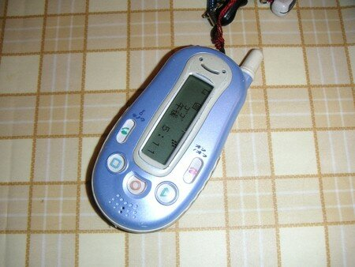

１１月２５日がWX310Kの発売日なので明日には今の京ぽんが使えなくなってしまうのだと思います。

[WILLCOM NEWS](http://blog.willcomnews.com/)さんでは、明日に備えてやっておいたほうがいいことがまとまっています。私も着信転送は設定しておこうと思っていたのですが、なんと転送先にと考えていた会社の携帯が突然電源が入らなくなってしまいました！

これは困ったどうしようと思っていたら、もう一台WILLCOMを持っていることを思い出しました。そう子供が使っている[**「ぴぴっとフォン」**](http://gazoo.com/pipit/pipitweb/index.asp?id=40)です！！

明日、あさっては学校なので使わないはず。これを借りて持ち歩くことにしましょう。

でも、電話がかかってきたらちと恥ずかしいなあとおもっているかんぱぱなのでしたぁ。

