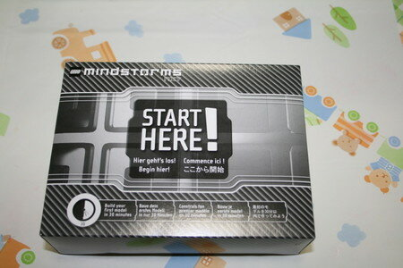
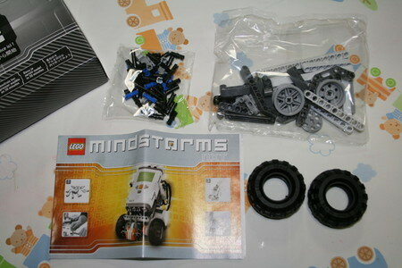

マインドストームNXTで最初のロボットを作ってみました。「START HERE!」と書かれた箱にパーツ一式とマニュアルが入っています。

箱の中のパーツはこんな感じです。

組み立てるとこんな感じです。組み立てには３０分もかからなかったです。

100円ショップで買ってきた単三マンガン電池６本で動かしたのですが、すぐバッテリが無いという表示になってしまいました。やはりアルカリ電池が良さそうです。

組み立てたあとになぜかパーツが３つ残ってしまいました。予備かな？（写真に映ってます。）
