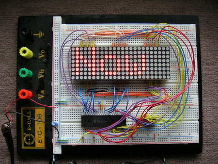
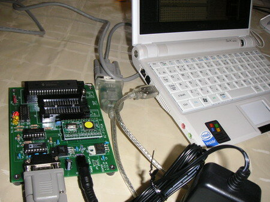

エレキジャックNo.4にあった電光掲示板を作ってみました。本当は基板にはんだ付けで小さくつくるのですが、面倒だったのでブレッドボードで組みました。

制御用のPIC 16F877Aの書き込みはASUS EeePCをホストに秋月のシリアル変換USBケーブル＋PICライターで行いました。こういうところにもEee PCが活躍してます。

最初はうまく動かなかったのですが、パスコンをつけ忘れていたので、きちんとつけたら動作するようになりました。  
あと、回路図どおりに組むと文字が逆方向に流れてしまうという状態だったので、トランジスタアレイに接続されている信号を逆順に組み直して正しく文字が表示されるようになりました。回路図が間違っているのかなぁ。
