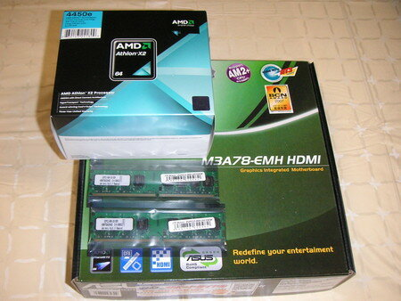

最近地デジのチューナーカードが発売されて、かなり気になっています。

とりあえず、我が家のデスクトップPCで地デジチューナカードが使えるかのテストプログラムを動かしたところ・・・

「だめでした」

Athlon64 3000+とRADEON 9600ではもうだめなのね・・・

というわけで、秋葉原にCPUとマザーボードを見に行ったのですが、手持ちのパーツが使えないものばかり。

ここは衝動買いをせず、一旦帰ってじっくり考えようということになりました。

いろんなサイトをみて、選んだパーツは以下の通り。

- Athlon X2 4450e 2.3GHz TDP 45W
- ASUS M3A78-EMH HDMI
- バルクメモリ DDR2-800 2GB×２

どうもAMDから離れられないなぁ。Core2 Duoも考えたのですが、TDP 65Wでお値段も高いし・・。

本当は4850e 2.5GHzにしたかったのですが、品薄のようで。確実に手に入り、少しお安い4450eにしてしまいました。

まあ、そんなに速度は求めていないので。大丈夫かなと。

あと、ビデオボードもAGPしか持っていないので、マザーボードはビデオ内蔵のAMD 780Gにしました。Vista Premium Readyって書いてあるし、まあRADEON 9600に比べれば何でも速いでしょう。

早速通販で発注です。

で、さくっと今日到着しました。速いね。

今週末に組み立てることにしましょう。
