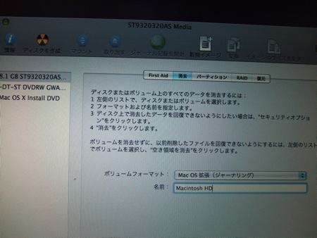
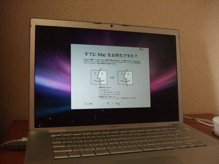
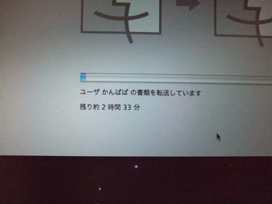
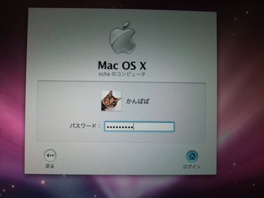

無事ハードディスクの交換が完了したMacBook Proですが、ハードディスクにはまだ何も無く画面には「OSフォルダがないよ」と表示されています。

  

普通ですと、内蔵していたハードディスクをUSBとかで接続して、データをコピーするという手段を使いますが、私の場合はLeopardからの新機能であるTime Machineを使ってゼロの状態から本当に復元できるのかを試してみました。

  

まず、MacOS X 10.5 Leopardをインストールします。

  

無事リンゴマークが表示されて読み込みが始まりました。

  

でも、当然ハードディスクはフォーマットすらしていないので、Leopardをインストールするディスクが無いと怒られました。

そこで、メニューのユーティリティからディスクユーティリティを起動して、ディスクをフォーマットします。これでインストールができる状態になりました。

  

あとは普通通りにインストールします。インストールが完了すると素晴らしいオープニングが表示され、その後「すでにマックをお持ちですか」という画面になります。

  

ここでTime Machineの出番です。Time Machineのバックアップから情報を転送します。

  

これで転送が始まります。あとは待つのみ。ここでは２時間３３分とか表示されていますが、そんなにはかからなかったと思います。（正確には計測していません。この間、もう一台のPCにLinuxをインストールしていたので・・・・）

  

無事ログイン画面になりました。

  

自動的に.Mac(MobileMe)のシンクも始まります。

  

一つ問題だったのは、ハードディスクの容量が大きくなった分、今まで使っていたTime Machineのディスクが足りなくなったことです。今回はTime Machineで使っているハードディスクのパーティションを切り直して、十分（？）な領域を確保してあげました。

  

このあと、たくさんのアップデータがかかったことはいうまでもありません。過去のパッチはすべて当たったと思います。

ユーザデータやシステムはほぼ問題なく復元されていましたが、iTunesの認証を再度行う必要があったことと、Parallels Disktopでネットワークが使えないというようなエラーがでてしまったので、Parallels Disktopだけは上書きインストールして復活しました。

それ以外は全く問題ないように見えます。以前使っていたハードディスクは保管してありますので、いざというときはUSB接続してデータを取り出すこともできますので、大丈夫でしょう。
