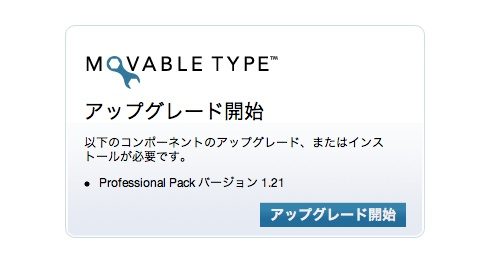
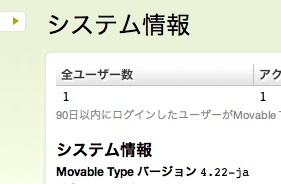

Movable Type 4.22?[セキュリティアップデート](http://www.sixapart.jp/movabletype/news/2008/10/15-1400.html)が公開されていましたので、早速アップデートしてみました。

手順は[ここ](http://www.movabletype.jp/documentation/upgrade/)にありますが、あまり具体的でないので実際の手順をまとめておきます。私の場合は、MacBook Proのターミナルからすべて作業しています。

  

1\. ダッシュボードから「ツール」→「バックアップ」でバックアップを取得。

2\. アップデータをダウンロード

3\. scpでサーバにコピー

4\. サーバにログイン。解凍する。

$ cd

$ unzip MT-4\_22-ja.zip

  

5\. 必要なファイルを現在のディレクトリからコピー

$ cd mt

$ cp mt-config.cgi ~/MT-4.22-ja/.

$ cd plugins/

$ cp -rp iMT ~/MT-4.22-ja/plugins/.

$ cp -rp HatenaAuth/ ~/MT-4.22-ja/plugins/.

$ cd ../mt-static/plugins/

$ cp -rp iMT ~/MT-4.22-ja/mt-static/plugins/.

  

6\. 昔のディレクトリを退避

$ mv mt mt.old

  

7\. 新しいディレクトリに置き換え。

$ mv ~/MT-4.22-ja/ mt

  

8.ダッシュボードにアクセス。次の画面がでる。

9\. アップグレード開始ボタンを押す。

10\. アップグレードされているかシステム情報で確認します。

  

新バージョンの4.22になっています

  

11\. 古いディレクトリを削除

$ rm -rf mt.old

  

12\. 作業完了
