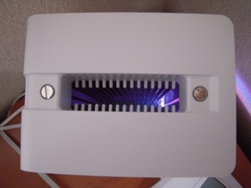

ディスク容量不足で途中で中断してしまったminiDV→iMovie'08計画ですが、近所のPCショップの広告をチェックしていたところ、日替り特価2TB RAID0/1 USBハードディスクが29,700円（限定3台）と載っていたのが目に飛び込んできました。

2TBのRAIDディスクにしてはなかなか無い値段かもということで、朝早くからお店の前に並んで、なんとか無事購入できました。機種はI-O DATAのHDC2-U2.0でした。

  

あまりこの機種のことは知らなかったのですが、ファンレスでかなり小型なものでした。電源アダプタは外付けになりますが、本体が小さくなるのであればやむを得ないと思います。

ファンレスの仕掛けは、昔のMac G4 cubeをご存知のかたならお分かりと思いますが、中央に穴が開いていてそこから熱が逃げる構造になっています。

↑

I-O DATA HDC2-U2.0を上から覗き込んだ写真

  

さすがにディスクがカリカリ言っている音は残りますが、ファン独特の音はありません。

まずは、Time Machineのバックアップディスクをこれに切り替えて、あとはminiDVのデータをどんどん落としていく予定です。

さすがに1TB(RAID1)もあればなんとかなるかなと思いますが、これからあとに控えているハイビジョン化を考えると、次はブルーレイを検討せざるを得ないでしょう。
