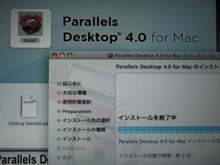

これまでParallels Desktop 3.0を使ってきましたが、4.0にアップグレードしてみました。12月末までディスカウントもあるようですし、大幅にUIや機能が変わっているようなので試してみたく思い切って購入しました。

インストール自体は簡単なのですが、これまで使っていた仮想マシンの変換に相当時間がかかってしまいました。

これから使い込んでみたいと思います。ディスクも広くなって少し余裕がでてきたのでWindows以外のOSも動かしてみます。

