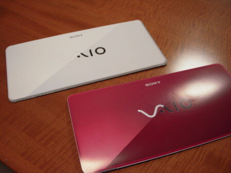
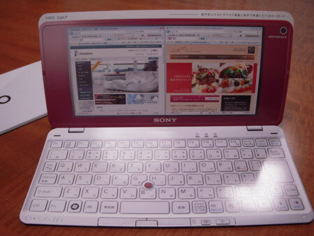

先日の新Mac miniの期待が外れたところで、SONYからVAIO type Pという魅力的なモバイルノートPCが発表されました。

最近はやりの低価格UMPCとは大きく異なり、価格はやや高めですが、高機能かつ軽量化が図られ持ちこび専用に設計されています。これだと本当にどこにでも持ち運べそうです。WINDOWS Vistaベースであるところがちと気がかりですが、後継のWindows7なども控えていますし、まあなんとかなるのかなと。

これまで、VAIO C1やVAIO Uを使ったことがありますが、VAIO C1はベストセラーになりましたが、VAIO Uはキーボードが小さすぎて使いにくく手放してしまいました。でも今回のVAIO type Pは非常に良くできています。原寸大のカタログで確認したところ問題ないように思います。重量も588gということで文句ありません。

早速、SonyStyleで先行予約をしようとしたところ、サイトが混雑しているようで、「ご迷惑をおかけし、大変申し訳ございません。ただ今、ご購入手続きが大変混雑しております。・・・」なるメッセージが。これは相当期待できそう。何回か試してようやく先行予約ができました。(2009年1月10日 0:45)

オーナーメイドで選んだモデルは一番安いモデルをベースにCPUを最速のものにし、SSD 64GB、オニキスブラックとなります。その他の機能はモバイルでは不要と判断しました。

到着は２月１日午前の予定です。Mac miniがVAIOに化けてしまいましたが、久しぶりに楽しみなマシンです。

量販店でもらったカタログです。

カタログを開くとこんな感じ。買うまえにぜひ見てほしいカタログです。
