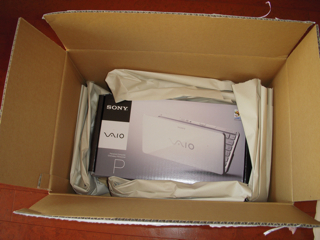
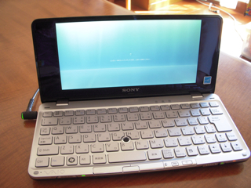

いつものSonyStyleの箱にて到着しました。  
箱を開けるとこんな感じです。

出てきました。これが本当の箱。

本体を取り出して、バッテリを装着しました。  
オニキスブラックは相当指紋が目立ちます。

電源を投入。ここで十数分待たされます。

起動したと思ったら、今度はWindows Updateです。  
私の場合は17個の更新プログラムがかかりました。これでまた十数分待たされます。

これでようやく使えるようになりました。  
とりあえず、秀丸とBeckyとTeraTermを入れて最低限の環境は整えました。  
ウィルスチェックはマカフィーのお試し版がついていたので、90日間はこれを使うことにしましょう。  
あとは早いうちにリカバリディスクを作らなければなりませんが、あいにくUSB接続のCD/DVDドライブを持っていないので、この機会にAmazonでBUFFALO USB2.0用外付けポータブルDVDドライブ DVSM-P58U2/Bを注文しました。いずれお世話になることでしょうし。  
VAIO type Pの使用感についてはまた後ほど。
