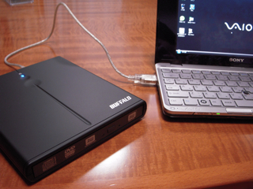

Amazonから注文していたポータブルDVDドライブが届いたので、早速VAIO type Pにつないでみました。  
バスパワーで無事稼働し、自動的にデバイスドライバが読み込まれ問題なく使えるようです。  
目的のリカバリディスクの作成をおこなってみたところ、「DVD-R DL 1枚か、DVD-R 2枚」を選んでくださいと表示されたので、こりゃ時間がかかりそうだということで今日は中止しました。  
気になる点としては、VAIO type Pの画面の文字が小さいので、96dpiから120dpiに表示設定を変更しているのですが、そうするとリカバリツールの画面でフォントがはみ出してしまい「次へ」とかいうボタンが見えなくなります。ボタンがでないので、適当にEnterキーを押したら次に進みましたが。このあたりは96dpiを前提としたアプリなのでしかたないんですかね。他のアプリでも同じような問題が起こりそうだなぁ。

