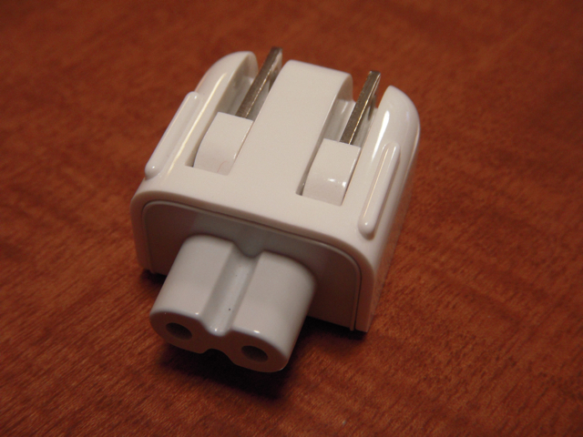

VAIO type Pを購入するときに、一番安いモデルから必要なものだけを追加してカスタマイズしたのですが、そのときチェックボックスを忘れたのが「ウォールマウントプラグアダプター」です。  
たった500円程度の追加だったのですが、「ウォールマウントプラグアダプター」がどういうものかよくわからずチェックをいれませんでした。  
あとでいろんな記事をみたところ、このアダプターはカスタマイズして購入するときしか選択できなくて、絶対に購入すべきとか・・・。  
まあ、別にいいやとおもっていたのですが、ふと自分のMacBook Proにそんなアダプタがついていたなぁと思いだし、ゴソゴソと探してみました。

なんとなくそのままVAIO type Pの電源アダプタに取り付けられそうな予感が・・・

すばらしいです。ぴったりです。さすが、Appleです！  
これで心のモヤモヤがすっきりしました。  
できれば、「ウォールマウントプラグアダプター」という名称は、「電源コンセント直付けプラグ」と書いていただければなぁと。わかりやすいと思いますが。
