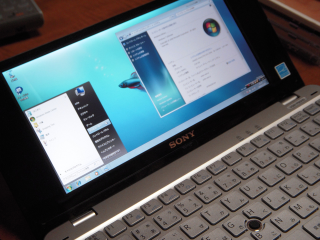

VAIO type Pを速くするという方法で、プリインストールソフトを削除する方法が紹介されていたので、途中までやってみたのですが、そもそもソフトを削除する時間が結構かかってしまい途中でやめてしまいました。  
もう一つの方法としてWindows 7のベータ版をクリーンインストールするという手がありますが、先駆者のかたの情報を探してみたところ、次のものがみつかりました。

> - [VAIO type PにWindows7を導入（２）](http://blog.nabe.jp/archives/000141.html) - なべラボ
> - [VAIO typePに、Windows7入れてみた](http://www.call-t.co.jp/blog/mt/archives/entry/009351.html) - コールとくしま店 店長のつぶやき日記

どうもこの内容をみているとあまりリスクが無いように感じましたので、思い切ってWindows 7をクリーンインストールしてみました。ただし、インストール時に今までのVISTAのWindowsフォルダはWindows.oldに残るようにして、必要なファイルはいつでも復元できるようにしました。  
インストールは全く問題なく終わり、Windows.oldに残ったドライバをインストールして、デバイスマネージャも奇麗に表示されるようになりました。  
ウィルスチェックのソフトはNorton 360のベータ版をとりあえずいれておきました。  
で、結果ですが、すごく快適になりました。これまでのVAIO type Pとは全く違う快適さです。  
私のVAIO type PはBluetoothやワンセグ、モーションカメラなど独自の機能は一切無いのでその分インストールするドライバも減っています。  
あとは、Windows.oldにあるユーザディレクトリのデータをお引っ越しして、必要なソフトを再インストールして完了です。この状態で８月までは使ってみたいと思います。こうなると製品版のWindows 7が待ち遠しいですね。

