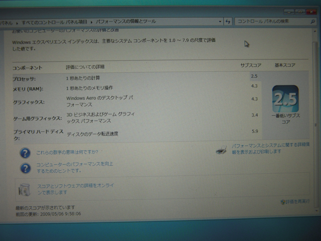

１つ前の記事でWindowsエクスペリエンスインデックスで、プロセッサのスコアが1.2と異常に低い値と書きましたが、デバイスマネージャを確認したところ、不明なデバイスが１つ残っていたので、VISTAのWindowsディレクトリに残っているドライバをインストールし不明なデバイスを無くしました。  
するとごらんのようにプロセッサのスコアが2.5にあがっています。VAIO type PのWindows 7用ドライバが提供されれば、もう少しスピードアップするかもですね。ちなみに、CPUはVAIO type Pでは最速のAtom Z540 (1.86GHz）です。

