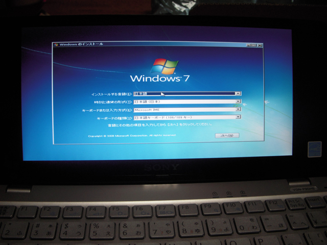

この前VISTAに戻したVAIO type Pですが、Windows 7 RCが入手可能になったので、またまたWindows 7 RCをインストールしました。

インストールは何事も無く完了したのですが、すごくモッサリしていてびっくり！  
よく見たらエアログラス（AeroGlass）の設定になっていたので、ベータ版と同様にAero BASICにしたところ、まあまあの速度になりました。Aeroをオフにするともっと速いですけど、まあ見た目も重要なので。

気になるのはWindowsエクスペリエンスインデックスのスコア。プロセッサの値が1.2と異常に低い値に見えます。VISTAで計ったときはプロセッサは3.0だったように覚えているのですが、どうしてでしょうね。CPUはVAIO type Pでは最速のAtom Z540 (1.86GHz）です。

