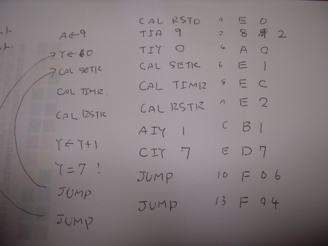

一通りのサンプルプログラムをGMC-4で試したところで、ゼロからプログラムを作ってみました。  
とりあえず７個のLEDを順番に光らせてみることにします。  
慣れている80系とはニモニックが異なりますが、命令コードが少なくレジスタ等はやや80系ぽいところもあり、そんなに難しくはありません。  
ハンドアセンブルですから、ここはやはり紙の上で考えてみます。



コードとしては以下のようになりました。（自分がわかるように書いていますので、雑誌での書き方とは少し異なるかも・・）

```
CAL RSTOL1: TIA 9L2: TIY 0CAL SETRCAL TIMRCAL RSTRAIY 1CIY 7JUMP L2JUMP L1
```

これを機械語に落とすと、

```
E 0 8 9 A 0 E 1 E C E 2 B 1 D 7 F 0 6 F 0 4
```

となります。

実行してみると一発で動作しました。LEDの右側から左側に１つずつLEDの光が流れていきます。

ちょっと遅いかなと思ったので、TIA 9 を TIA 2に変更して少し速くしました。

```
E 0 8 2 A 0 E 1 E C E 2 B 1 D 7 F 0 6 F 0 4
```

あとは音をつけたりとか、同時に7セグメントLEDも光らすようにするとか、いろいろ拡張してみたいと思います。
