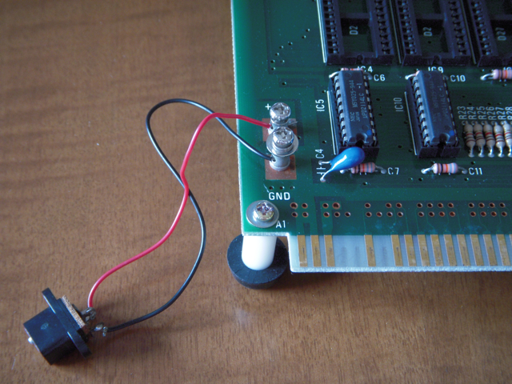
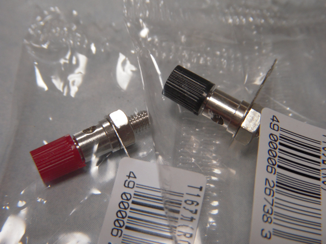
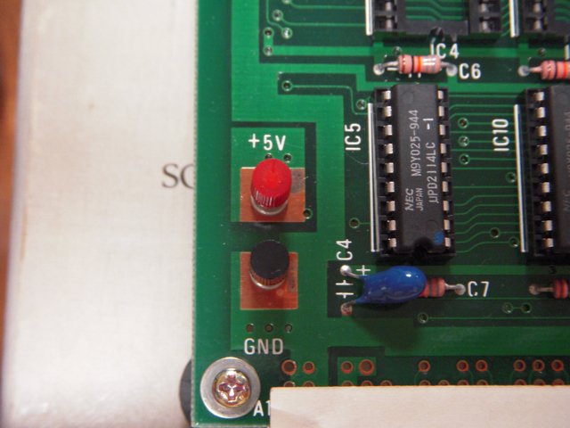

学研の4ビットマイコンに触発されて、NEC TK-85を久々に引っぱりだしてきました。  
付属品を確認したところ、マニュアルが無く、基板を固定するためのゴム足のネジが一部紛失、電源端子のネジが紛失という状態でした。  
とりあえずゴム足のネジは適当なものを見繕いました。電源端子のネジも普通のネジで問題無さそうなのでそれで代用。マニュアルはあちこちのWebを探してみましたが、ヤフオクでも売っておらず、TK-85について取り上げられているWebぐらいしか資料がないようです。  
まずは、ゴム足を取り付けて、基板を空に浮かせます。次に電源端子に愛用の秋月の[超小型スイッチングＡＣアダプタ(5V 2A)](http://akizukidenshi.com/catalog/g/gM-01801/)をつなぎました。

８個の７セグメントLEDに０が表示され、とりあえずは動作しているようです。

Webで見つけたサンプルプログラムを入力しましたが、さすがに古いせいかキーボードのチャタリングを拾ってしまうようで、１回のキー操作で、アドレスが２つも３つも進んでしまい、慎重に入力する必要がありました。

電源端子はやはりきちんと直しておこうと、マルツパーツ館で探したところ同じ仕様と思われるもの（[サトーパーツ T-16](https://www.marutsu.co.jp/user/shohin.php?p=6503)）がありました。

早速購入して交換しておきました。

キーボードのチャタリングはなんとかしたいところですが、とりあえずはこのままで。  
もう少し遊んでみたいのですが、何せマニュアルが無く、回路図などもないので、もしマニュアルをお持ちの方が見ていましたら、コメントください。  
ちなみにTK-80の本があるようなので、それは注文しておきました。確かコンパチなので情報が使えるかなと。これも楽しみ。
