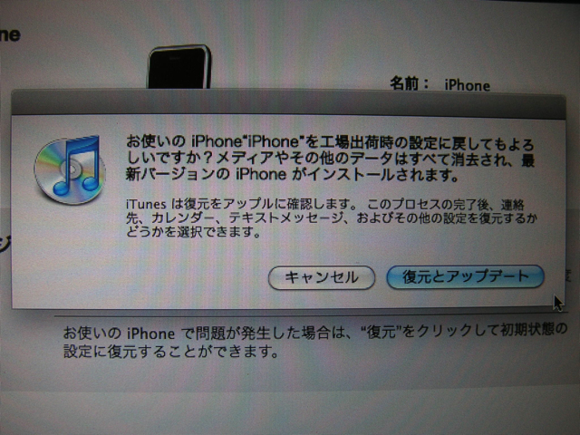

先日iPhone OS 3.1のアップデートがありましたが、私も当然公開当日にアップデートをかけました。そうしたら、いきなり次のようなエラーがでてしまいました。

「iPhoneをアップデートできませんでした。不明なエラーが発生しました（2006)。」

さて困ったなと、再度アップデートしようとしたら、「iTunesはリカバリモードのiPhoneを見つけました。iTunesでご利用になる前に、このiPhoneを復元する必要があります。」というメッセージが。復元はまだ一度もやったことが無かったのですが、しかたなく復元に取りかかると、工場出荷時の設定にもどるというメッセージが・・・。

iTunesでMacにiPhoneのデータはバックアップされているとは思うのですが、さすがに冷や汗ものです。でも、これをしないと先に進まないので、思い切って「復元とアップデート」を行いました。  
Macからのバックアップデータの復元にかなり時間がかかりましたが、無事アップデートと復元が完了しました。スケジュールや住所録はMobileMeにもありますので、万が一何かあっても大丈夫とは思うのですが、SMSがどうなっているか心配でした。でもSMSもちゃんと復元されていたので一安心です。これからもこまめにバックアップするように心がけます。
