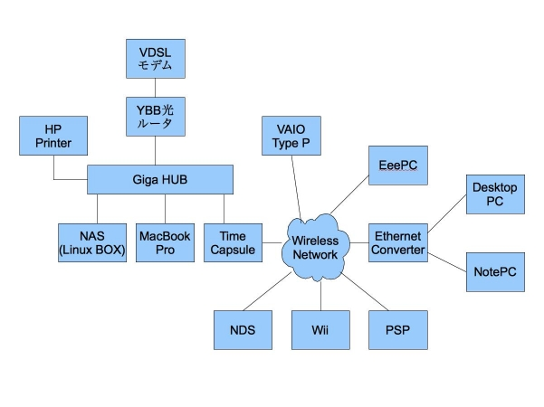
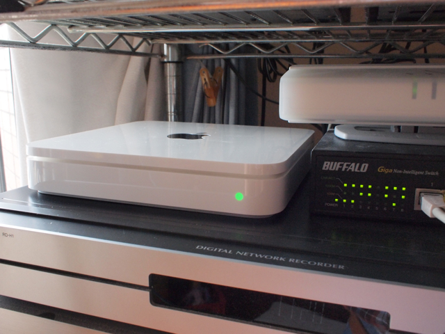

アップルのTime Capsule 1TBの価格引き下げがありまして、この機会に導入してしまいました。  
いままでローカルに接続していた外付けHDDがいっぱいになってきて、Time Machineでのバックアップが厳しくなってきたのです。NASをごにょごにょすれば、Time Machineでのバックアップも取れるみたいですが、現状250GBしかなく、MacBook Proのバックアップには足りません。NASのHDDを増やすという手もあるのですが、置き場所も厳しく、昔から使っていた無線LANの親機が古くなっていることも気になっていたので、1TBのNASと無線LANの最新APを買うと同じ程度の値段となり、ビックカメラのポイントも使えるので、思い切ってTime Capsuleの導入となりました。  
設定は非常に簡単ですが、我が家のネットワークはすでにYahoo!BB光ルータが入っているので、Time Capsuleのルータ機能が不要になります。これは、AirMacユーティリティの手動設定でブリッジモードにすることで問題なく設定できます。参考までに我が家のネットワークを示します。

こんな感じでごちゃごちゃつながっていますが、Time Capsuleに切り替えても特に問題なく接続できました。  
もちろん、ネットワーク経由でMacBook ProのバックアップもTime Machineを使って問題なく行えるようになりました。これで、外付けHDDの空き容量も確保できたのでビデオ編集とかにも余裕ができて助かります。  
気になるのはTime Capsuleの発熱です。後ろ側半分がかなり熱くなります。AirMacユーティリティで内部温度とか表示されると良いのですが、そういう機能はありませんので、ちと心配です。ただ、ケースの外側が熱いということは、内部の熱が効率よくケースに伝わっているという見方もできます。ケースからの放熱を妨げないように、金属板の上（実はビデオデッキですが）に設置し、上部は空間をあけるようにしています。これで様子を見たいと思います。

