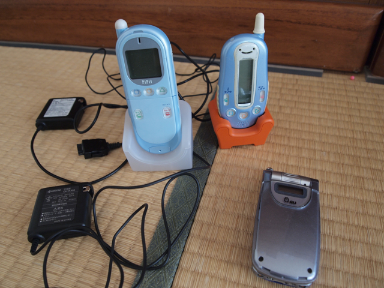

不要になった携帯を販売店などにもっていくと回収してくれて、抽選券がもらえるそうなので、子供のおもちゃになっていた携帯を持っていきました。  
持っていった携帯はDDIポケットの子供用PHSと、ソニエリのau携帯の３台です。

もちろん持っていく前に可能な限りデータは削除しました。暗証番号を思い出すのに苦労しましたが。

お店では携帯本体だけを回収していて、充電器は回収してくれません。これも金属資源にはなるとは思うのですが。不燃ゴミにするしかなさそうです。  
携帯本体は回収したその場で２カ所穴をあけてくれます。１カ所は電源スイッチをつぶすように空けるので、完全に電源は入らなくなりますが、穴をあけた部分以外のデバイスを同じ機種の基板に載せかえることで、もしかすると情報が復元できるかもしれませんが、そんな手間をかける人もまずいないかなと。

もらった応募券はWebページで入力して、抽選するのですが、なんと３枚中２枚が当たってしまいました。シルバーコースなので1000円×２の商品券が届くようです。これには思わずニッコリ。  
あと、２台ぐらいたんすケータイがあるはずなので、探してみたいと思います。
