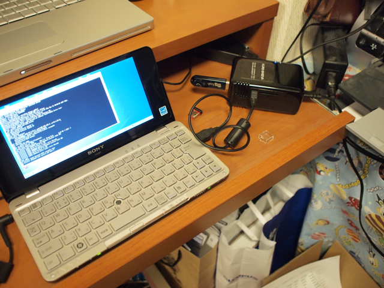

なかなか時間がとれなくてできなかったのですが、KURO-SHEEVA（玄柴）のカーネルを日経Linux 3月号の記事をもとに行ってみました。  
mini rootが入ったUSBメモリの書き込みは、MacBook ProのParallels DesktopにインストールしているUbuntu 8.04上で行いました。こちらは特に問題なくUSBメモリにmini rootを書き込むことができました。  
続いてそのmini rootの入ったUSBメモリを使って、玄柴を起動です。

日経Linuxの記事は良く書けていて、すんなりカーネルの更新ができました。  
ただ、記事中の「カーネルモジュールを展開」ではUSBメモリは/dev/sdb1と書かれていますが、私の場合は/dev/sda1でした。  
カーネルをアップデートすると2.6.22.18から2.6.32.3になります。  
起動メッセージはこんな感じになります。

> Starting kernel ...  
> Uncompressing Linux...................................................................................................................................................................................... done, booting the kernel.  
> Linux version 2.6.32.3 (yoneda@debian) (gcc version 4.3.2 (Debian 4.3.2-1.1) ) #1 PREEMPT Sun Jan 10 15:45:24 JST 2010  
> CPU: Feroceon 88FR131 \[56251311\] revision 1 (ARMv5TE), cr=00053177  
> CPU: VIVT data cache, VIVT instruction cache  
> Machine: Marvell SheevaPlug Reference Board  
> 　：  
> 　：

記事にある[SheevaPlugのユーザが配布しているカーネル](http://sheeva.with-linux.com/sheeva/)ですが、もっと新しいものがあるようですので、そのうち最新カーネルにもチャレンジしたいと思います。
