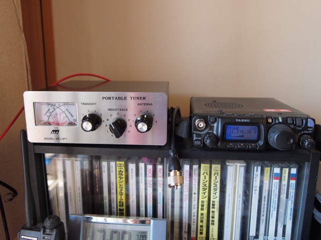

先日のハムフェアでアンテナチューナーを衝動買いしてしまいました。  QRPにも対応しているMFJ-971です。愛機のFT-817と組み合わせて使います。訳あり品で少しだけ安くしていただきました。 とりあえず、近くのホームセンターでビニール線を10mほど買ってきて、ベランダの中で張り巡らせました。釣り竿を使うという方法もあるようなのですが、持っていないのでとりあえず。 結果ですが、さすがに7MHz帯は厳しいようでしたが、21MHz帯ではいろいろ受信することができ、長崎のアマチュア局が59+で入感しました。あまりにも適当にワイヤーを張っているので電波は出しませんでしたが、他のバンドなども試してみようと思います。久しぶりにHF帯の電波を聞くことができただけでも収穫でした。
