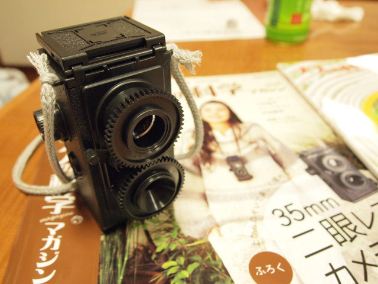
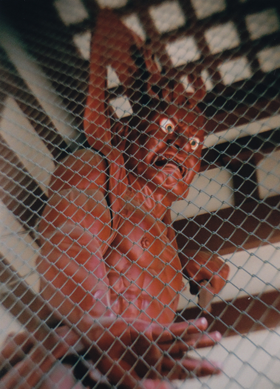

以前から買おうとおもっていた大人の科学の二眼レフカメラをようやく買ってきました。  
キットの内容はこんな感じ。

組み立ては１時間程度と書いてありましたが、なかなかメカニカルな部分が多くやや手強かったです。シャッターのメカには非常に関心しました。こんな簡単な仕組みでちゃんとシャッターとして動くんですね。  
最後にネジが２つ余ったのに焦りましたが、余ったネジは予備ですと書いてあったので一安心。  
完成品はこちら。結構カッコいいです。ひもは良いものが無かったのでApple Storeの買い物袋に付いていたひもを切って使っています。  
  
早速、久々にISO 400の35mmフィルムを買って二眼レフカメラにセットしました。  
フィルムを巻き上げるときにカウンターがスムーズに動かず、スプロケットのツメがフィルムにうまく引っかからないことがあるようでした。もうフィルムを入れてしまったので、裏ふたを開けるわけにも行かず、巻き上げるときは少し裏蓋を軽く押すことでなんとか回避しました。  
今回いれたフィルムは24枚撮りなので、10枚程度室内で撮影し、10枚程度屋外で撮影してみました。デジカメのように撮影結果がすぐ確認できるわけではなく、本当に映っているのかなとかなり心配です。でも、昔はこうだったんですよね。  
このカメラの特徴でもある上から覗き込むファインダーの像がなんともきれいで不思議な感じがします。ファインダーの像をiPhone 4で撮ってみました。雰囲気が伝わるでしょうか。  
  
調子にのって撮影を続けていましたが、フィルムの終わりがどのあたりなのかがよくわからず、最後のあたりはなるべくゆっくり巻き上げるようにして、微妙に力が必要になってきたなというところで、フィルムを巻き戻しました。フィルムが切れていたらどうしようと思いましたが、ちゃんとカウンタが逆に回ってフィルムは無事でした。  
早速現像してプリントしましたが、室内で撮影したものは露出不足でうまく撮影できていませんでした。絞り板は外したほうが良かったかもです。屋外で撮影したものはそれなりに撮影できていて一安心でした。  
一番うまく取れたかなという写真を掲載しておきます。  
近くのお寺にある仁王尊です。プリントしたものをスキャナでデータ化しています。  
  
他の写真はMobile Meのギャラリーに公開していますので、興味のあるかたはのぞいてみてください。  
[http://gallery.me.com/kanpapa/100187](http://gallery.me.com/kanpapa/100187)  
ご覧になるとわかりますが、フィルムを巻き上げるのを忘れていて二重露光してしまったものもありますのでご勘弁を。
