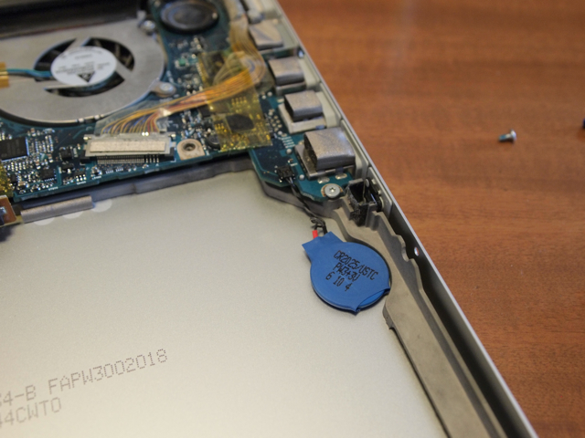
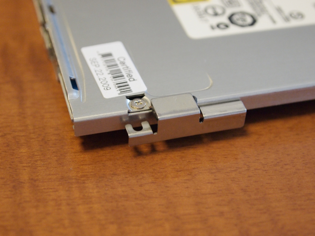
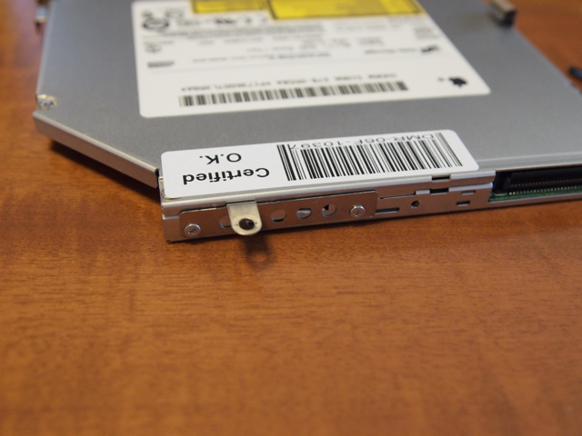
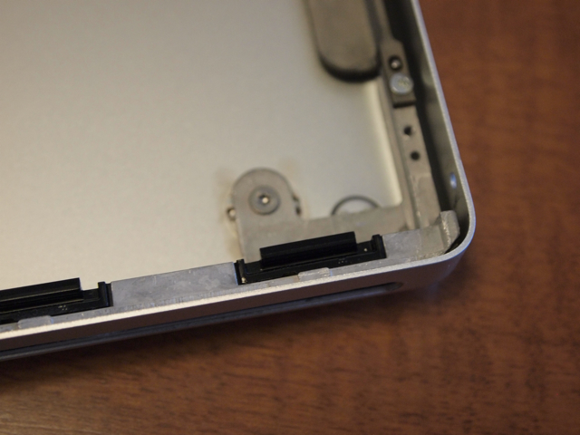
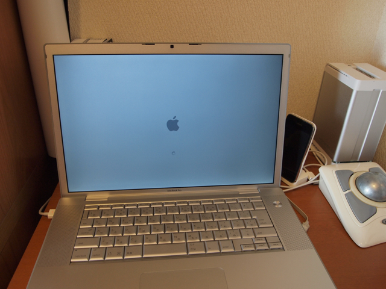
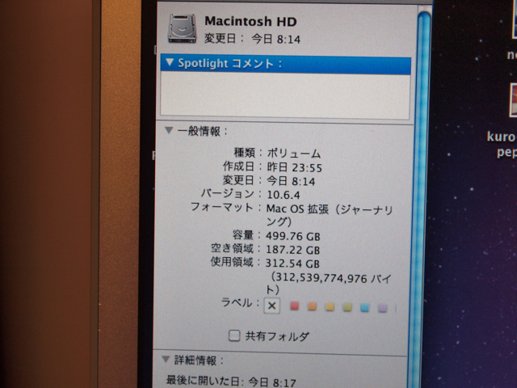
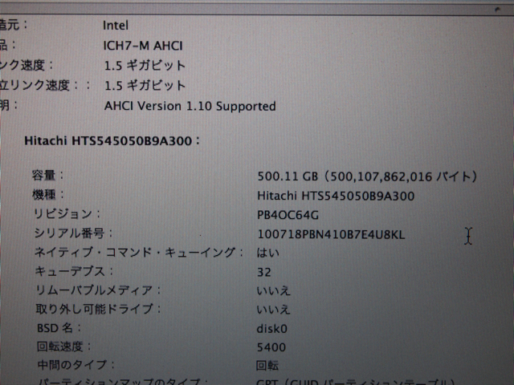
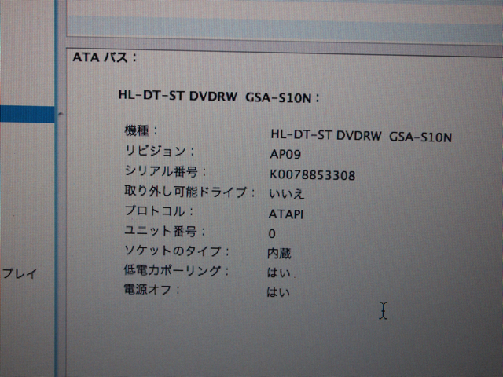

MacBook Pro(15-inch Core 2 Duo 機種ID:MacBookPro2,2)のハードディスクとDVDの交換を行いました。  
※この記事のようにふたを開けると当然メーカー保証もなくなります。自己責任でお願いします。  
[新しいハードディスクへの交換が完了](https://kanpapa.com/2010/10/macbook-pro-hdd-dvd-1.html)したので、内蔵DVDの交換に入ります。  
ここから先は今回初めての作業になります。  
ASCII.JPの[MacBook Pro 1.83GHz/2.0GHz(2006年1月発表、15インチモデル)](http://ascii.jp/elem/000/000/352/352409/)の記事の内容とはだいぶ状況が違っていまして、記事ではネジ２本で簡単に外れるとありましたが、私の場合はネジを４本外す必要がありました。  
ネジを４本外してDVDドライブを外します。

DVDドライブの下にはバッテリが取り付けられていました。いつかこれも交換する日が来るのでしょう。

外したDVDドライブには固定用のブラケットが３つネジ止めされているので、それも外す必要があります。  
これと。

これと。

これです。

DVDドライブを外したときの逆の手順で新しいDVDドライブを取り付けます。  
以上でDVDドライブの交換が完了です。  
さてふたを締めようとしたときにトラブル発生。最初に苦労して外したツメの部分ですが、１カ所ツメが引っかかるところごと外れていたのです。

しまったと思いましたが、もう一度DVDドライブを外して、外れたプラスチックのパーツをボディにとりつけピンセットの柄の部分で押し込むことで直りました。やはりこのツメの部分は要注意です。

分解とは逆の手順で組み立てて、ネジも余らず元通りになりました。電源を入れてしばらくするとアップルマークが表示されました。これで一安心。

ハードディスクの容量を確認。無事500GBになっています。

念のためシステムプロファイラでも確認。

DVDドライブも認識されています。もちろんDVDやCD-ROMの読み込みもOKです

交換後の状態ですが、ハードディスクの発熱が減ったのではないかと思います。

これでしばらくは大丈夫かなと思いますが、システムプロファイラでも分かるように、HDDは3.0 Gb/sをサポートしているのに本体は1.5 Gb/sしか対応していません。またこのMacBook Proはメモリが3GBまでしかハード的につかえないので、仮想環境など使うときに今後メモリが厳しくなってきそうです。次は交換ではなく、買い替えになってしまうかもですね。
