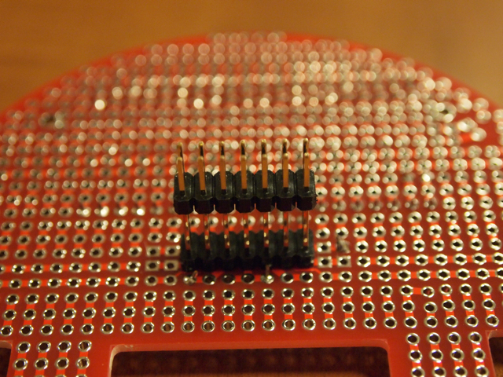

[m3pi](http://mbed.org/cookbook/m3pi)を作ってみました。  
m3piとは[Pololu 3pi robot](http://www.pololu.com/catalog/product/975)というロボットプラットフォームを[mbed](http://mbed.org/)で制御しようという試みです。  
Pololu 3pi robotには2つのモータ、LED、LCD、5つの光学センサー、ブザー、3つのボタンスイッチを持っており、ATmega328Pマイコンを搭載しています。普通の使いかたであれば、3pi robot本体だけでライントレーサ等を作ることができます。もちろんATmega328Pに書き込むためのISPは必要です。  
Pololu 3pi robotの特徴として[拡張用の基板](http://www.pololu.com/catalog/product/979)を取り付けることができます。これを利用してATmega328Pとmbedをシリアル接続し、Pololu 3pi robotにファームウェアとしてサンプルプログラムであるシリアルスレーブプログラムを載せて、それをmbedから制御することでPololu 3pi robot本体を動かします。このため、mbedと3pi robotの接続はVcc, GND, TXD, RXD, RESETの５本だけで済んでいます。

完成したm3piです。  

3piと拡張ボードを外すとこうなります。

mbed拡張ボードの拡大写真。配線はほんの少しです。

  

拡張ボードからmbedを外した様子。配線は3本しかみえませんが、裏面で2本接続しています。両方とも[StarBoard Orange](http://mbed.org/cookbook/StarBoard-Orange)のように2x20Pソケットにしたかったのですが、拡張基板のパターンの都合で片側は1x20Pとするしかありませんでした。

Pololu 3pi robotとの接続コネクタはこのようになっています。

<figure>

<figcaption>

OLYMPUS DIGITAL CAMERA

</figcaption>

</figure>

MTM06に間に合わせるために急いで拡張基板のハンダ付けを行い、3piのATmega328Pに[serial slaveプログラム](http://www.pololu.com/docs/0J21/10.a)を書き込み、[m3pi\_HelloWorld](http://mbed.org/users/chris/programs/m3pi_HelloWorld/lhnzxb/docs/main_8cpp_source.html)のサンプルプログラムをコンパイルしてmbedに転送すると、あっさり動いてしまいました。

https://youtu.be/Q0xCMMv0uKM?si=uZEHRZj4Ix4GMEp1

mbedを使うことで、プログラミング環境も簡単になりますし、mbedに他のセンサーやハードウェアを接続することでより高度なPololu 3pi robotの制御ができるのでは無いかと思います。拡張基板の空きスペースにbluetoothとかNetworkとか搭載すると面白いなと考え中です。

今回１点困ったのが、拡張基板付属のネジです。  
今回赤い拡張基板を使ったのですが、付属ネジの長さがなぜか短く、スペーサーを使って基板を取り付けることができませんでした。MTM06にはしかたなくネジ止めせずに持っていきましたが、帰宅して黒い拡張基板の付属ネジを確認したらちょうど良い長さです。  
左側が黒い基板の付属ネジで、右側が赤い基板の付属ネジです。明らかに長さが違います。なぜこうなっているのかは謎です。

今回のm3piの記事についてはmbed Notebook [m3piを作ってみよう (in Japanese)](http://mbed.org/users/kanpapa/notebook/m3pi/)にまとめておきましたので、そちらも参考にしてください。
