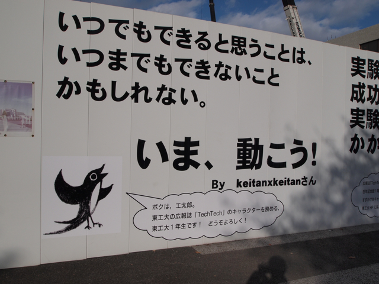

ちょっと書き込みが遅れてしまいましたが、Make: Tokyo Meeting 06 (MTM06)に行ってきました。場所はいつもの大岡山の東工大です。

前回も新図書館の建築中でしたが、まだ工事中でした。今回は[広報誌 Tech Tech](http://www.titech.ac.jp/publications/j/new/index.html)のキャラクタの工太郎くんがお出迎え。

体育館中央では原寸大のはやぶさがお出迎え。この前の宙博にはこれを展示したほうが良かったのではないかと。

早速mbedコーナにいってご挨拶。当日の午前中だけで組み上げたm3piを一時的に置かせていただきました。少しでもmbedに興味を持っていただければと。

あとは、会場をみてまわりましたが、今江科学さんのジャイロカーの発展形のジャイロモノレールが良かったです。あと、連立方程式が解ける機械、ペーパークラフトでつくった巨大な戦艦大和とか。目新しいものも多かったし、人も多かったです。

私は結局WiiChuckアダプタだけ購入しました。3pi robotにちと投資してしまったので倹約ぎみです。  
mbedコーナの出展者のみなさん。いろいろありがとうございました。
