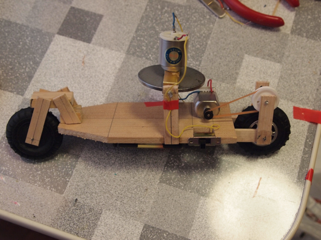

今年の夏休みの自由研究としてMTM05でパンフレットをもらった[今江科学さんのジャイロカー](http://www.imae-kagaku.com/gyro.html)を子供が作りました。  
残念ながら工作精度があまり良くなくて、安定した走行を見せることはできませんでした。  
しかし、学校の文化祭で展示することになり、再度フレームを一から作り直しました。  
今回は今江科学さんのWebページに詳細な工作マニュアルがありましたので、そちらを参考にして精度を高めたところ安定して走行できるようになりました。

このジャイロカーは二輪車です。タイヤは２つしかありません。このためジャイロがまわっていないと写真のように倒れてしまいます。

しかし、ジャイロを回してそっと手を離すとこの通り。倒れることなく走ります。

https://youtu.be/eAMh1wqmV5s

物にぶつかっても止まったままでも倒れることがありません。  
このような単純な仕組みで安定して走行できることに学校のみんなが興味をもってもらえるといいなと思います。
