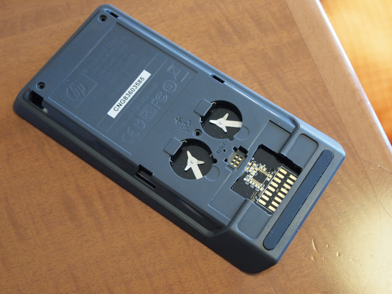

HP20bの分解が終わったところで、JTAGコネクタをつける部分のケースに穴を開けます。  
私の場合は今後の作業がしやすくなるように、結構大きめに穴を開けてしまいました。

ただし、ここまで大きく開けてしまうと、外側のカバーケースをロックする部分が無くなり、非常に甘くなりますので注意してください。  
次に電卓本体とケースをはめ合わせます。

電池をいれて動作確認。良くみるとわかりますが、外側のケースを固定するところが無くなってしまいました。

動作は特に問題ないようです。

反省点としては、窓はもう少し狭くして、外側ケースのロックをする部分は残しておいたほうが良いでしょう。  
困っている点は表面実装用のピンヘッダがなかなか見当たらないことです。もし、秋葉原で見かけた場合はぜひ教えてください。  
どうしても見つからなかったら、フラットケーブルをハンダ付けかなぁ。
