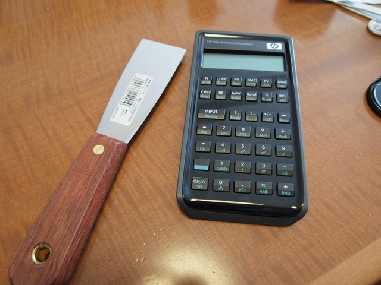
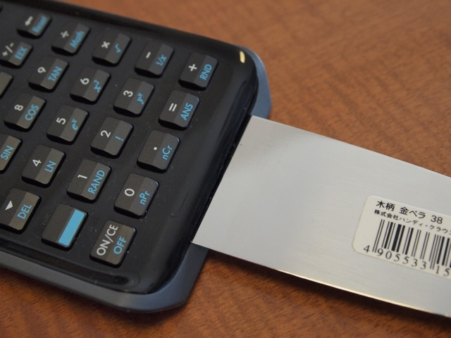
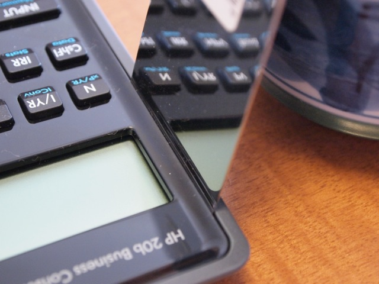
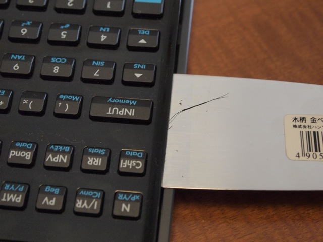
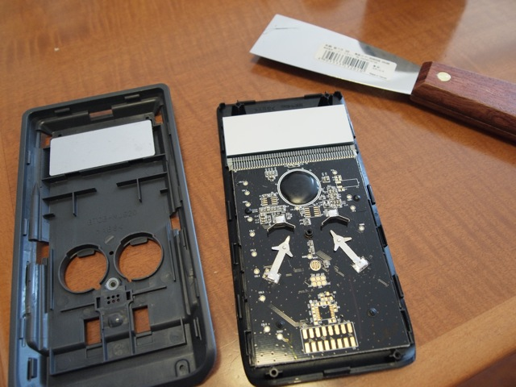

去年の年末から大きな話題になったHP20bのケースを開けてみました。今年初めての分解作業です。  
工具は先が薄い金ヘラと精密ドライバーになります。  
**あくまでも参考手順です。分解は自己責任でお願いします。**  
まず外側から見える場所のネジ3本と、ゴム足の下にある2本のネジを精密ドライバーで外します。  
ゴム足は全部めくるのではなく、端を少しだけめくって、ネジを取るようにしました。  
次に難関のプラスチックのツメですが、こういう構造のツメをはずすのに最適の工具があります。写真に映っている先が薄い[金ヘラ(幅38mm)](http://www.7netshopping.jp/home/detail/-/accd/2100367872/subno/1)です。これは以前Mac miniを分解するときに購入したものです。今回もこれが役立ちました。ちなみにホームセンターで一般的に売られています。

こんな感じで隙間に金ヘラを差し込んで少し斜めにするとツメが外れます。

同様に横のツメも外していきます。

このように斜めにするとツメがはずれて浮き上がります。

すべてのツメを外して、ケースを開けることができました。ほとんど傷はついていません。

この方法であれば何度でも開け閉めできそうです。  
次はJTAGコネクタを付けるためのケースの加工に入ります。
