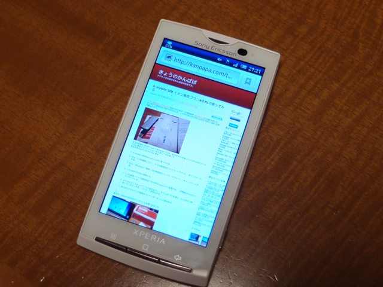
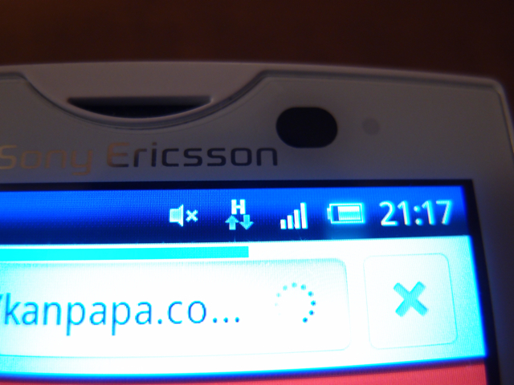

月額980円のイオン b-mobile SIM(上下100kbpsベストエフォート)を[動作確認機種](http://www.bmobile.ne.jp/aeon/devices.html)に含まれているスマートフォン Xperia SO-01Bで使ってみました。  
もちろん中古品をヤフオクで手に入れました。この機種はAndroid 2.1ですが、今後バージョンアップは無いということなので、これからも価格は下がっていき入手しやすくなるのではと思います。

通常ですとSIMが入っていない状態では全く使えない状態になっていますが、b-mobile SIMをセットして、[b-mobileのウェブサイトに掲載している手順](http://www.bmobile.ne.jp/aeon/setting.html)で設定をすると、NTT DOCOMOとして回線が認識されます。もちろん、SIMロックを解除したりすること無くそのまま使えます。

  
  
Androidは初めて使うので操作に慣れるまで少し手間取りましたが、使用感は以下のような感じです。  
一般のWebサイト：すごく遅いと感じることもなく十分使える状態でした。  
メール：Gmailで試しましたが、問題無く使えます。  
Twitter：速度的にも問題なく使えます。  
地図：やはり画像データの取り込みに時間がかかりますが、少し待てば表示されます。  
動画系：試していません。多分無理。  
Androidマーケット：アプリケーションのサイズが小さいものであれば、待っていればダウンロードできますが、できればWi-Fi環境で行ったほうがいいでしょう。  
結論としては、月額980円のb-mobile SIMでは、データ量がそれほどでもないもの（Web、メール、Twitter等）であれば十分使えるということです。  
もちろん音声通話はできませんが・・・。  
あとは実家でのアクセス状況を確認するだけですが、これは夏休みまでお預けということで。
