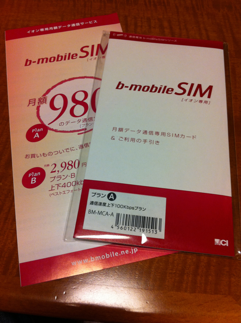

月980円というお手頃価格で100Kbpsまでが使える[イオンのb-mobile SIM プランA](http://www.bmobile.ne.jp/aeon/index.html)を契約してきました。 実は明日でWILLCOMのPHSを解約することになっていて、データ通信回線を何にしようかなと考えていた矢先でした。 これまで使っていたWILLCOMのPHSはW-VALUE割引のおかげで月980円でつなぎ放題ができるプランだったのですが、２年を経過したのでW-VALUE割引が終わってしまい割高になってしまうのです。 そこで、これまでと同じ月980円でデータ通信ができるこのイオンのb-mobile プラン Aに飛びつきました。 出先からの利用なので、そんなに高速である必要はありませんが、実家に帰ったときはPHSの電波が弱く、わざわざ２階で使っている状態でした。それがNTT docomoの回線に変わるのですから安心です。 先週の日曜日に販売店舗であるイオン品川シーサイド店に行ってみましたが、あいにく売り切れ。予約は受け付けているということでしたので、プランAで予約しておき、今日入荷の連絡がありました。 早速、イオンに向かうと、契約カウンターがすべて埋まっていてみんなb-mobileの契約のようです。私も30分ぐらい待ってから受付してもらえました。ちなみに品川シーサイド店は21時までの受付だそうです。 契約は特に問題なくスムーズに進みました。身分証明書とクレジットカードが必要ですが、さらにメールアドレスも必要です。b-mobileのお客様ページのアカウントになるので、メールアドレスは必須です。 契約手続きはイオンのカウンターで行いますが、契約後のサポート（初期不良も含む）はすべて日本通信のサポートにするように念を押されました。 また、契約時の説明資料では、100Kbpsなので使えるものと使えないものが絵で示してあり、メール、Webは○、地図は△、Skype、YouTube、USTREAMは×となっていました。まあ、それで十分なのですが。 購入したパッケージはこちら。  早速試してみたいところなのですがまだ使えません。というのもこのSIMが使える通信機器を持っていないのです。 ただその点は抜かりはなく、明日ぐらいにはヤフオクで買っておいた[ドコモデータ通信端末 L-05A](http://www.nttdocomo.co.jp/product/data/l05a/)が到着するはずです。ちなみに新品未使用で1600円程度（送料込）でした。 これで、これまで使っていたPHSと同程度の通信環境でVAIO type Pが活用できそうです。 そのうちSIMフリーのスマートフォンがもっと安く手に入れられるようになったらそちらでも活用できると思います。
