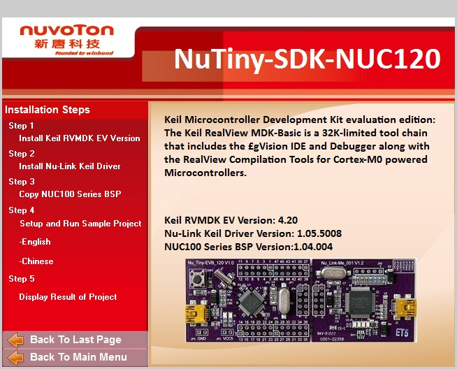

秋月で買ってきたNuTiny-SDK-NUC120を動かしてみました。  
DVD-ROMがついています。付属品はそれだけです。紙の説明書はありません。  
DVD-ROMをWindows PCに入れると、次のような画面が出てきます。

開発環境をインストールした後にサンプルプログラムを動かしますが、この説明がアニメーションになっていて、分かりやすいです。なお、開発環境は評価版なので32KBまでですが。  
また、動作中のビデオ画像も入っています。このあたり親切にできていると思います。  
私も早速動かしてみました。

https://youtu.be/KRsfO9KUL\_0
