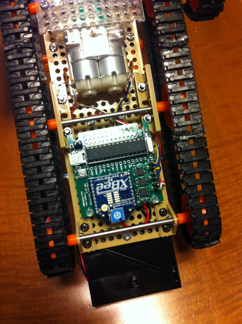
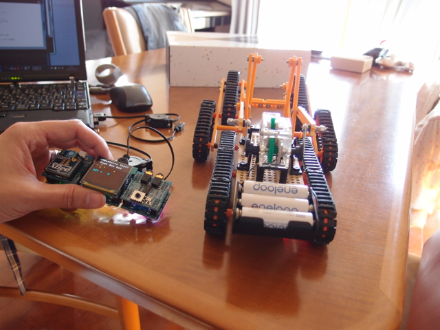

前回[MBeeDuino](http://www38.atpages.jp/~nakakure/pukiwikiplus/index.php?MBeeDuino)単体でタミヤの[レスキュークローラー](http://www.tamiya.com/japan/products/70169rescue/)を制御してみましたが、MBeeDuinoはXBeeが搭載できるのが特徴です。これを活用しないわけには行きません。  
XBeeをつけても走行の邪魔にならず、USBが簡単に接続できるように最終的には次の写真のように実装しました。  
キャタピラの横からUSBケーブルをMBeeDuinoに接続しファームウェアの書き込みができるようになっています。

  
この状態で、まずはPCから無線で制御してみました。  
XBeeをMARY XB基板に載せて、PCとシリアル接続をしてTeraTermから文字を送信することで、入力文字に応じた動きができました。

テストなので前進、後進しか機能をつけていませんが特に問題なく動作します。  
しかし、PCから制御するのはイマイチです。小さいリモコンのようなものがあると手軽ですよね。  
そこで思いついたのはMARYをリモコンにしてしまうことです。  
MARYにはXBeeが実装できるXB基板や４方向スイッチや圧電サウンダが載っているUB基板があります。  
これを組み合わせれば電池で稼働するリモコンができるはずです。  
実際に作ってみるとこんな感じです。ほぼサンプルプログラムがそのまま使えたので30分ぐらいでできました。  
各種サンプルが揃っているのでMARYは手軽です。

さて、MARYリモコンを使って、実際に動かしてみました。

いかがでしょう。レスキュークローラーはその名の通り障害物があってもガンバッて進んでくれるので面白いですよ。  
ちょっとMARY UB基板のスイッチは小さいので操作がしにくいですね。  
CB基板（ユニバーサル基板）にもう少し大きいスイッチ載せて使うのが良いかもしれません。

  
追伸：電池BOXがキャタピラから大きくはみ出していると引っかかるので、縦に取り付け直しました。

