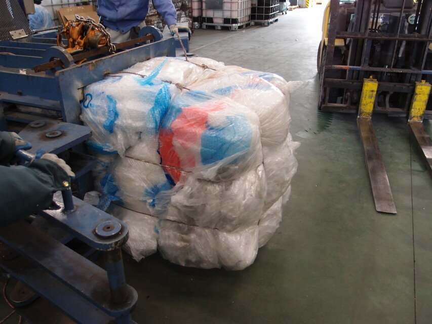
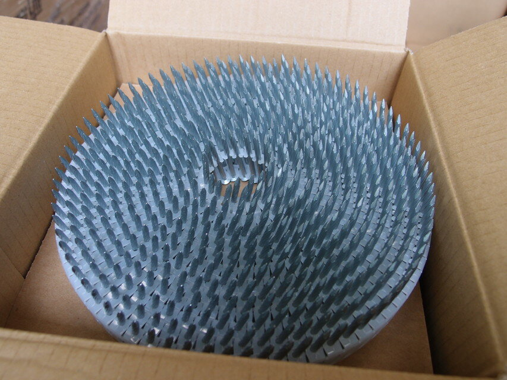
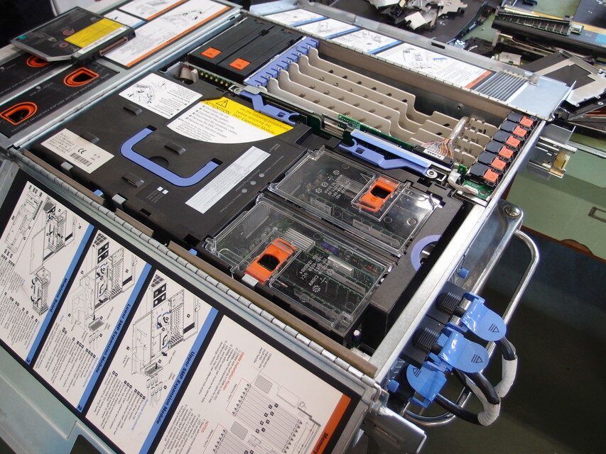
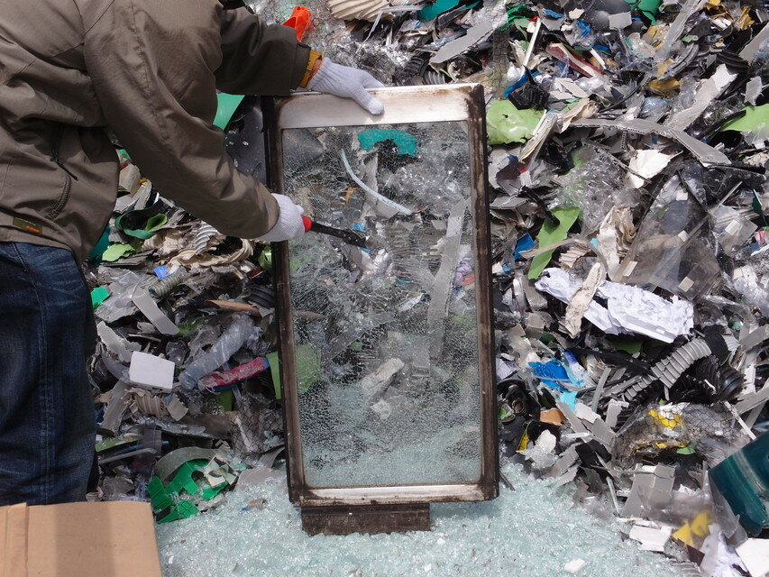
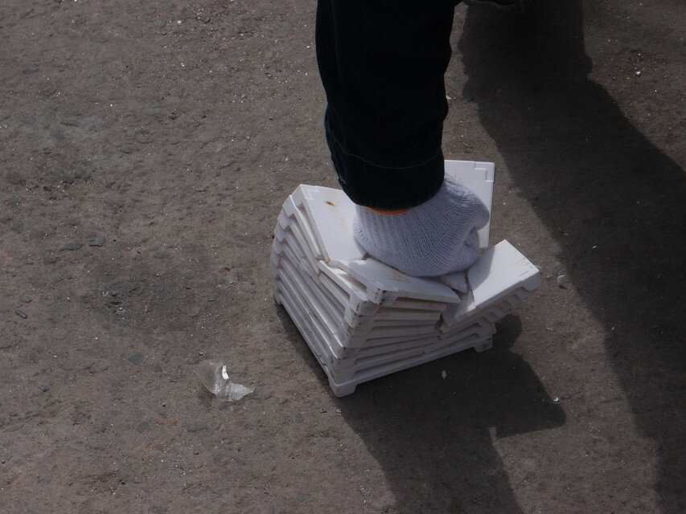
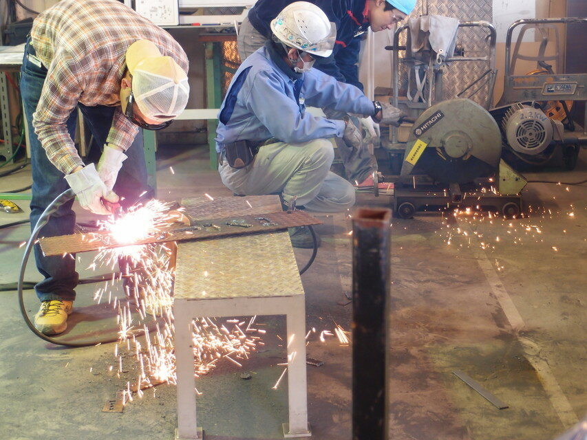
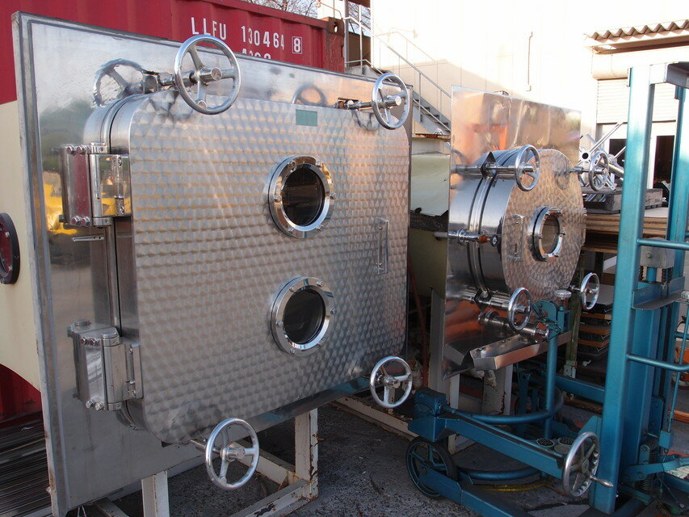
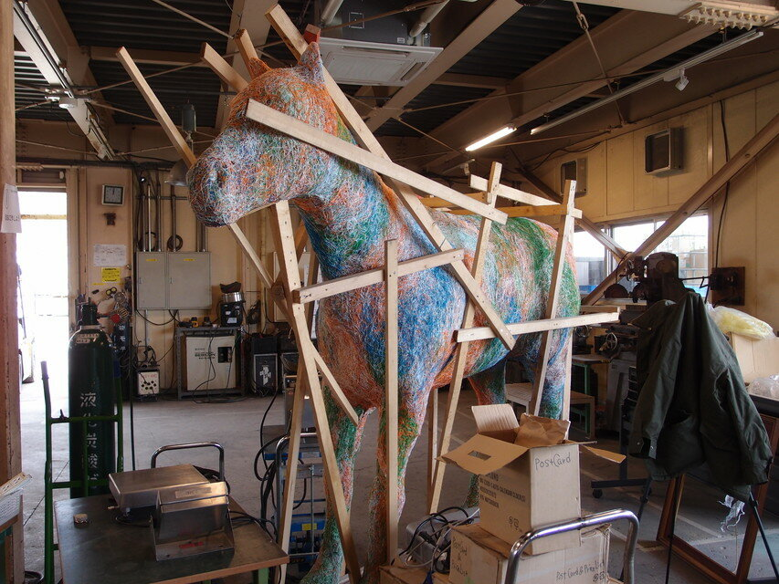

2012/3/20に[モノファクトリー](https://www.monofactory.com/ "モノファクトリー")（ナカダイ前橋工場）で開催された工場ハックに参加しました。

今回体験したのは以下の内容です。

### １）「鉄をプレスしよう」

実際に運転席に座らせてもらったのでドキドキでした。  
自分が操作するスイッチで巨大な鉄くずを引きつけたり落としたりできました。

### ２）「エアキャップを梱包しよう」

沢山いれすぎてなかなか出てこなかったです。何事も入れ過ぎは良くないですね。

### ３）「発泡スチロールを溶融しよう」

こちらも沢山発砲スチロールをいれすぎて機械が止まってしまいました。投入限度を明確に決めておいたほうが良さそうです。溶融された発砲スチロールはこのような塊ででてきます。

### ４）「１m3 を解体・破砕しよう」

１m3 が何であるのかと、破砕機の仕組みを親切にご説明いただきました。

１m3 が巨大なシュレッダーに吸い込まれるのは楽しかったです。

### ５）「蛍光灯を破砕しよう」

蛍光灯をガンガン投入させていただきました。破砕機の構造や破砕後のガラスの様子やこの後どうなるのかまで詳しく説明いただきました。

### ６）「箱開け作業をしよう」

箱の中から何が出てくるのかは楽しみでした。ただ、箱の種類が限られていることもあり、もっと様々な箱が混在しておいてあると面白いと思いました。

### ７）「OA 機器を解体しよう」

作業場所が混んでいて見学が中心となってしまいました。作業台がもう一つ欲しいところです。

### ８）「ガラスを選別・破砕しよう」

強化ガラスがあれほど固いとは思いませんでした。割っても飛び散らずに安全に作られているのが確認できました。

### ９）「セラミック板を割ろう」

ハンマーで割らせていただきました。これもなかなか体験できないことなので面白かったです。子供のころには瓦とかを金槌で割っていたのを思い出しました。

### １０）「自由に工作しよう」

作業しているところを見学していました。金属溶接や切断など楽しそうでした。  
作るもののアイデアを考えてくれば良かったです。

モノファクトリーには家庭では使えない道具が揃っているのですが、もっと手軽な工具もあるといいですね。  
ハンダ吸い取り機とかハンドドリルや万力やキリとか、中学校の工作室にあるようなものもあると取っ掛かりやすいと思います。  
あとは、作業をしていると手が汚れますので、屋外に水道と石けんがあると良いですね。

ナカダイの社員のみなさんはすごく親切でした。  
ジャンク品を探していたら、探しやすくなるようにモノをフォークリフトで移動してくださいました。  
各コーナでも細かいところまで説明いただきました。また、出会う度に挨拶も必ずしてくれました。好感がもてます。

気になるマテリアルもたくさんあります。産業廃棄物として回収されたものがどうなっていくのか知ることができました。

またこのような機会があったらぜひ参加したいですね。
