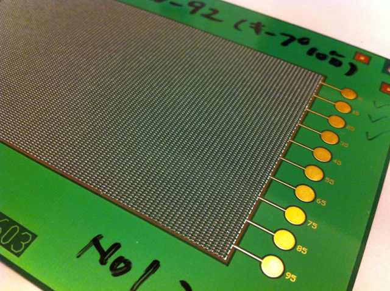
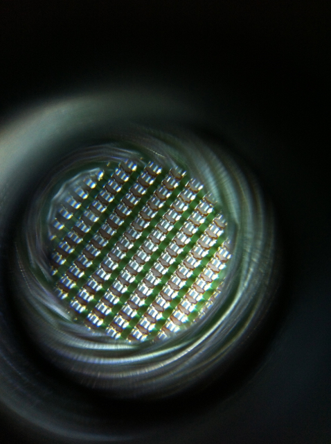

ナカダイ渋谷市場が5月20日までだということなので、あわてて行ってみました。スペースは広くはないですが、[工場ハック](https://kanpapa.com/2012/07/factory-hack-summer.html)で見かけたものが沢山あり懐かしかったです。

あの1m3が看板になっていました。

今回手にいれたマテリアルは以下の通り。

何かの無線系モジュールの生基板と何かの金属が樹脂で固められたアイテム。

12枚も同じ基板があるので何かのオブジェクトが作れそうな気がします。

表面実装パーツを沢山取り付けた基板。実装機械の評価用と思われます。

こちらはざらざらした板に見えますが、実は小さい表面実装パーツが実装されています。

ちなみにこの基板を40倍のマイクロスコープで拡大するとこうなります。

これはもはや芸術品ですよね。
