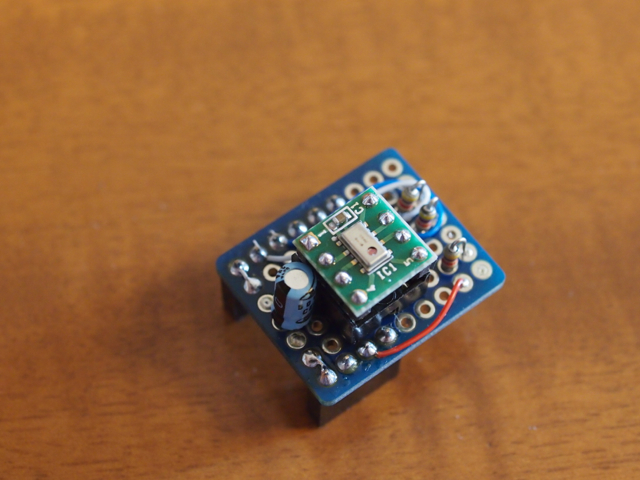
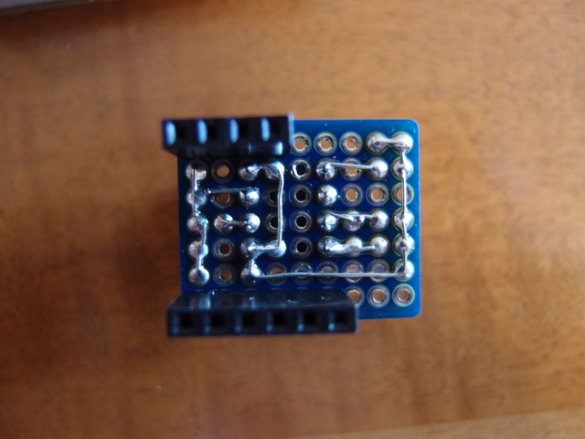

[千石電商](https://www.sengoku.co.jp/)でこんな切手大のサイズのユニバーサルボードを見かけました。

7segduinoに丁度良いサイズだなと思ったので、秋月電子のMPL115A2モジュールとこの基板を使って7segduinoの気圧計拡張ボードを作ってみました。回路図とファームウェアは[@morecat\_labさんのサイト](http://morecatlab.akiba.coocan.jp/lab/index.php/aruino/7segduino/7segduino-application-3/)にアップされているもののままです。

作ってみたところ、こんな感じになりました。

表面

<figure>

<figcaption>

OLYMPUS DIGITAL CAMERA

</figcaption>

</figure>

裏面

<figure>

<figcaption>

OLYMPUS DIGITAL CAMERA

</figcaption>

</figure>

7segduinoに取り付けるとこんな感じです。

取り付け面

表示面

正常に動いているようです。お天気とこの値を比べてみたいと思います。
