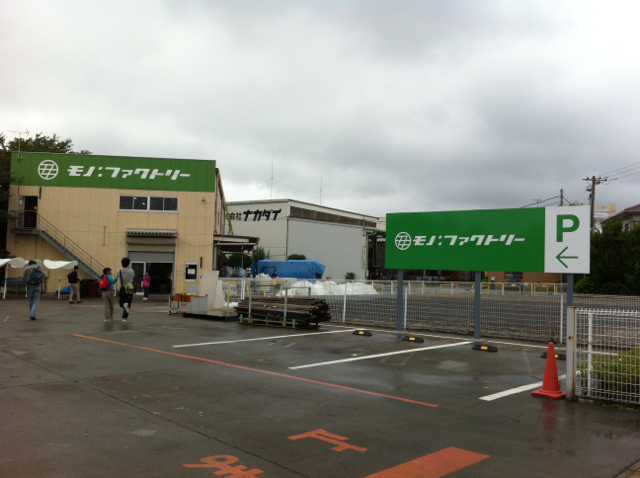
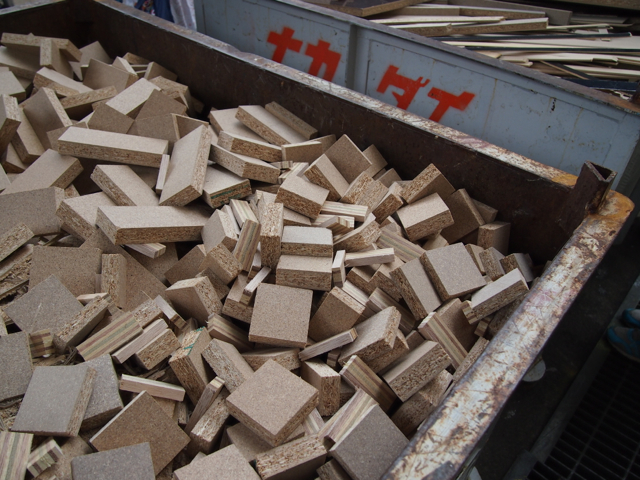
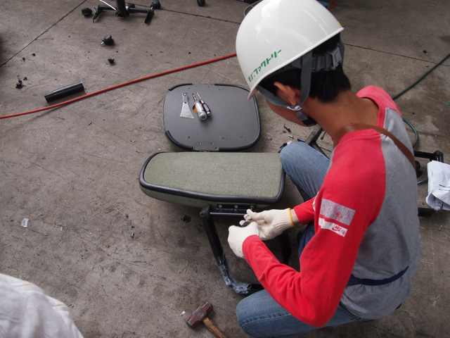
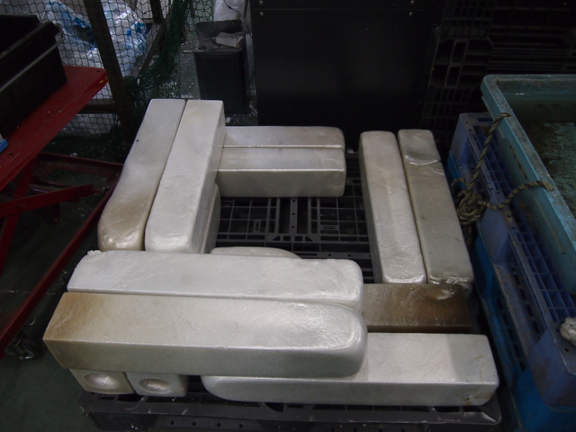
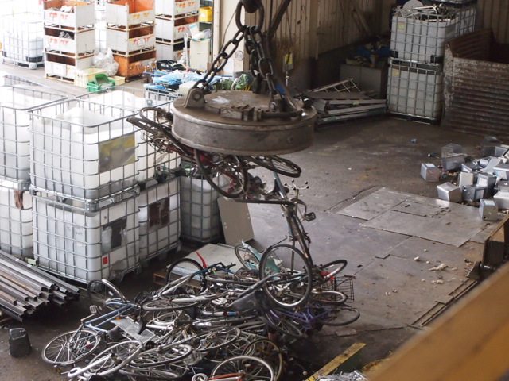
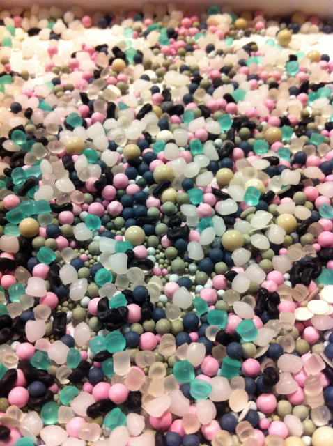
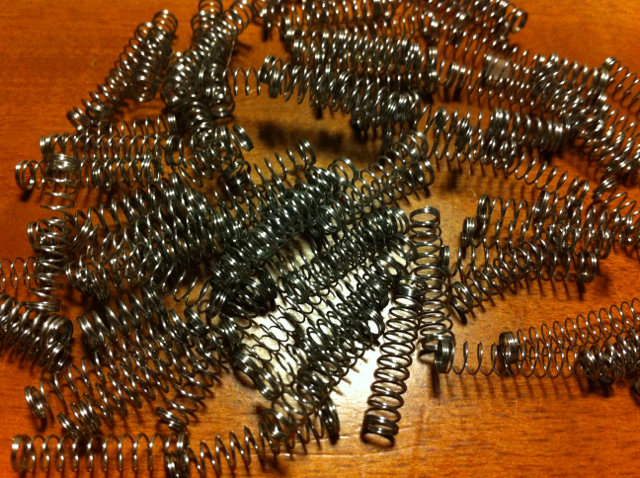

前回の「[工場ハック](https://kanpapa.com/2012/03/factory-hack.html)」に引き続き、「工場ハック サマースクール」に行ってきました。

今回はサマースクールということもあり、子供もOKとのことなので、自家用車でナカダイの前橋工場に出かけました。

自宅を７時に出て開始時刻の１０時前には到着しましたが、やはり結構遠いですね。帰りを考えるとツアーバスが正解だったかもしれません。

サマースクールの内容ですが、午前中はナカダイ前橋工場を見学です。前回の工場ハックのときにくらべて構内が整理されているというか、廃棄物の量が前回ほどではなかったように思います。やはり前回の３月というのは年度末なので廃棄物が多い時期なのかもしれません。

私は２回目なので見慣れたものでしたが、子供の目から見ると珍しいものばかりで、ゴミはこうなるのか、こんなにたくさんあるのかという実感がつかめてもらえたのではと思いました。

昼食はお弁当をいただきましたが、そのあとに工場でのリサイクル作業を体験しました。最初にやったのは椅子の分解です。

ハンマーとエアードライバーと厚めの金属ヘラで要領よく分解していきました。足の部分はヒトデと呼んでいるそうです。

次に発泡スチロールを粉剤して樹脂にリサイクルする工程を体験しました。発砲スチロールをどんどん機械に投入して、できたてほやほやの樹脂が入った金属ケースを取出して水で冷やすところまでできました。あれだけ大量の発砲スチロールがコンパクトな樹脂になるのは面白かったようです。

さらに体験は続き、１ｍ３というシャンプーが入っていた巨大な容器を粉砕する作業を行いました。フォークリフトで１ｍ３を粉砕機に投入するのですが、フォークリフトのレバー操作を実際に自分で行い投入し、粉砕されるところまで体験できました。

次は金属プレスです。時間がおしてしまいましたが、前回同様の体験をすることができました。今回は自転車をマグネットで移動させることをしましたが、自転車は金属くずとは違ってひっかかりが多いのでうまくくっついてくれません。３月の時のように金属くずが多ければよかったのですが。

一通り工場体験が終わったあとに銅線をたたいて作る指輪をみんなで作りました。銅線や銅板を金属の棒に巻きつけて、その上からハンマーでたたいて模様をつけていきます。当然たたくと銅は伸びるので程よいところで金属の棒から外して形を整えるという作業を繰り返して指輪をつくりあげました。それなりのものができたのではと思います。

最後はマテリアルハンティングです。モノファクトリーの２階にマテリアルが置いてあるのですが、これも前回と違って少し量が少なめでした。でも子供は大喜び。見たこともないマテリアルがたくさんあるので、ビニール袋に詰めていきました。下の子は粒状のプラスチックがお気に入り。いろんな種類のプラスチックを袋に詰めました。

上の子は少し大きなモータと携帯のアンテナとボールペンのばねを買いました。何に使うかはわかりませんが満足したようです。

最後にツアーバスを見送って、私たちも家路につきました。

<figure>

<figcaption>

OLYMPUS DIGITAL CAMERA

</figcaption>

</figure>

毎回思いますが、ナカダイさんの社員のみなさまは本当に親切な説明とご指導をいただきありがたいです。

子供もまた来たいといっていましたので、工場ハックだけではなくマテリアルハンティングでもまた来ようと思います。

楽しい夏休みの一日になりました。
