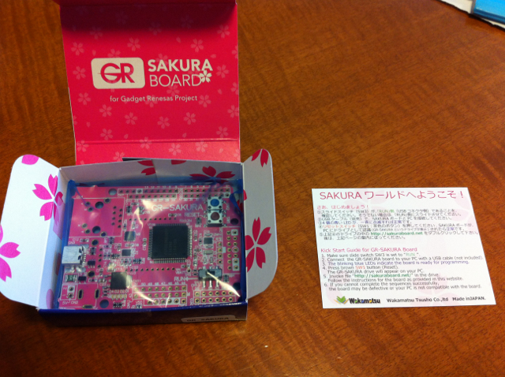
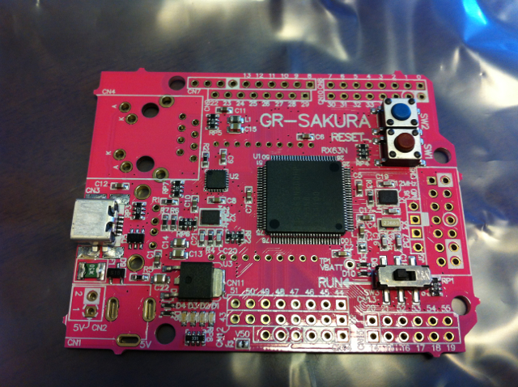

若松通商に予約注文していた[GR-SAKURAボード](http://japan.renesas.com/products/promotion/gr/index.jsp)が届きました。

パッケージのデザインはすごく凝っていますね。何かのお土産みたいです。

  

ふたを開けると、簡単な説明書が入っています。

このふたの内側もちゃんとさくらのデザインですよ。

説明書を取り出すと、GR-SAKURAボードが顔を見せました。

この１枚ペラの説明書ですが、裏面はピンレイアウトの説明図になっているので重宝します。

静電防止袋から取り出すときれいなさくら色のGR-SAKURAボードが出てきました。

私の場合は基板だけ購入したので、あとで手持ちのDCジャックとかRJ-45コネクタをハンダ付けしようと思います。

ちょっと気になったのが、基板のバリ。

このような感じで全部で８カ所バリがあります。

まあ、ヤスリで削ればいいんですけど。

あとで電源をいれて動作確認をしてみたいと思います。
