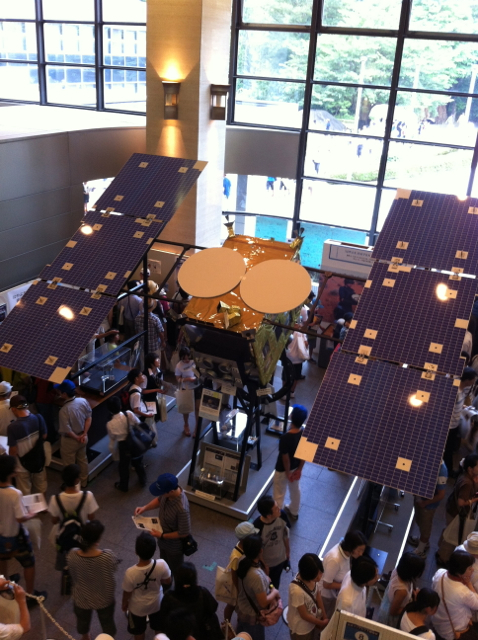

以前から行って見たかったのですが、なかなか機会がなく、今年ようやく行くことができました。

いろんな展示物はあちこちで紹介されていると思うので、ここでは私の気になったものだけ。  

はやぶさブースはやはり大人気ですね。

こんなものもありました。よく見ると[秋月電子のマイコンボード](http://akizukidenshi.com/catalog/g/gK-02298/)が使われてます。

さすが秋月電子ですね。

アマチュア無線の特別局も運用していました。

自動販売機もかっこいいですね。

出口にもいろいろあるようです。

