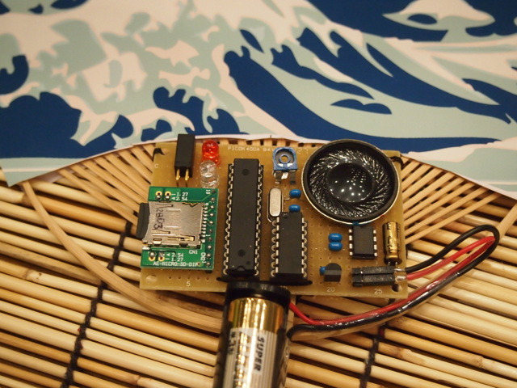
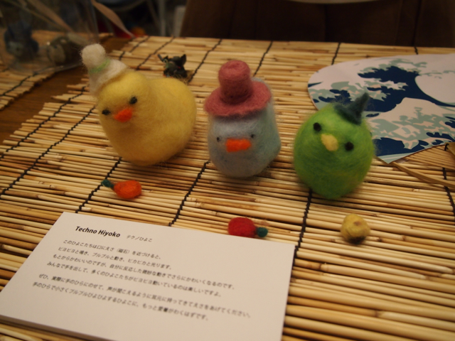
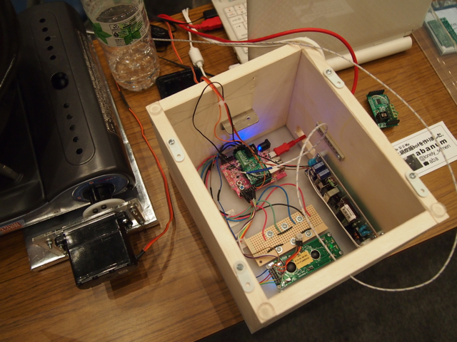
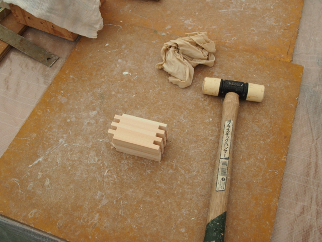

Make: Ogaki Meeting 2012のレポートの続きです。

## ワッショイうちわ

うちわであおぐといろんな音がでます。波の音とか風鈴の音とかありましたよ。

うちわをあおいだかどうかは基板の左上にある振動（傾斜）スイッチで検知しています。

## テクノひよこ

くちばしの近くに餌を近づけると鳴いたり光ったりします。餌は磁石になっていて、頭にあるリードセンサーが反応していろんな動きをします。ひよこの頭にいれるために制御基板は小さく作ってありました。（ひよこの後ろに小さく写っています。）

## 土鍋炊飯bot

土鍋でおいしいご飯を炊くための仕掛けです。鍋に取り付けた温度センサーの情報からマイコンでサーボを制御してガスコンロの火加減を調節するというちょっと危険な香りのする作品です。

マイコンは制御BOXに実装されていましたが、中身を見せていただきました。

ちなみにこれを使うときは必ず人間が監視しているそうです。

## 名刺をどうぞ

レゴで作った名刺配布機です。レバーを倒すと名刺が１枚でてきます。簡単な構造ではありますが、レゴをうまくそして奇麗に使っています。動力はゴムだけです。

## 枡づくり体験ワークショップ

そうこうしているうちに予約しておいた枡作りの時間になりました。

材料はこんな感じで、参加費はなんと100円です。（こんなに安くていいのかしら・・）

これまでこのような木工製品はあまり作る機会が無かったのですが、ワークショップの担当のかたや一緒に枡を作られている参加者のかたからもアドバイスをいただいてなんとか形にはできました。

完成したものはこちらです。

Make: Ogaki Meetingの焼き印も入りかっこ良くできました。

とても良い記念になりました。手伝ってくれたかたありがとうございました。
