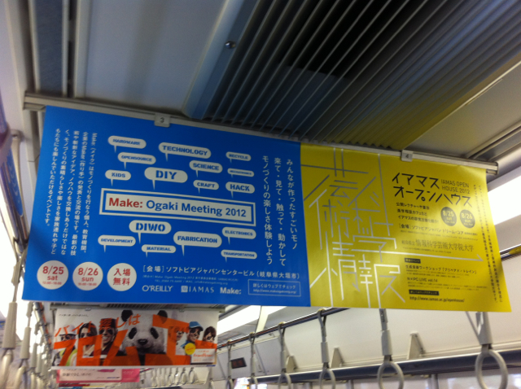
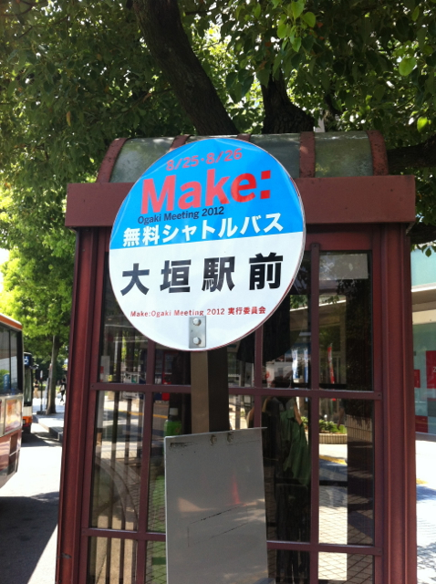
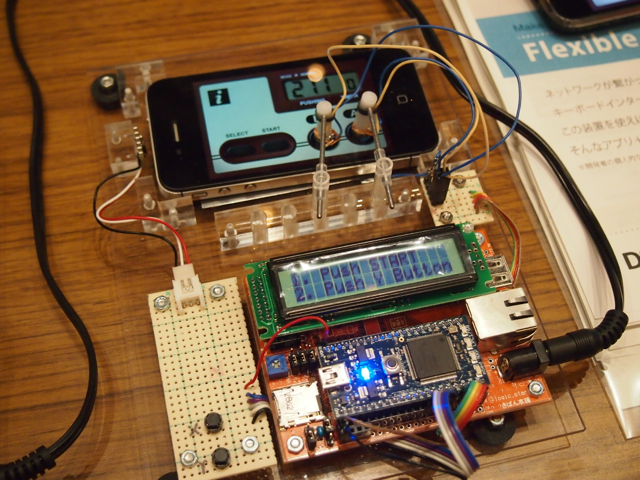
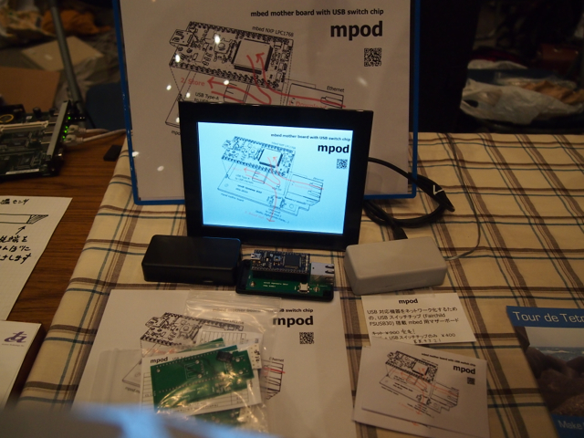
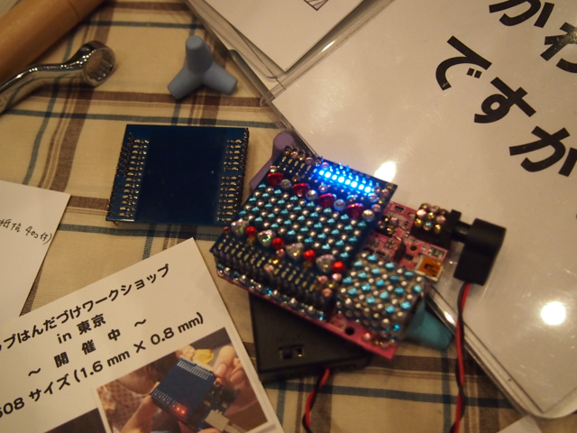
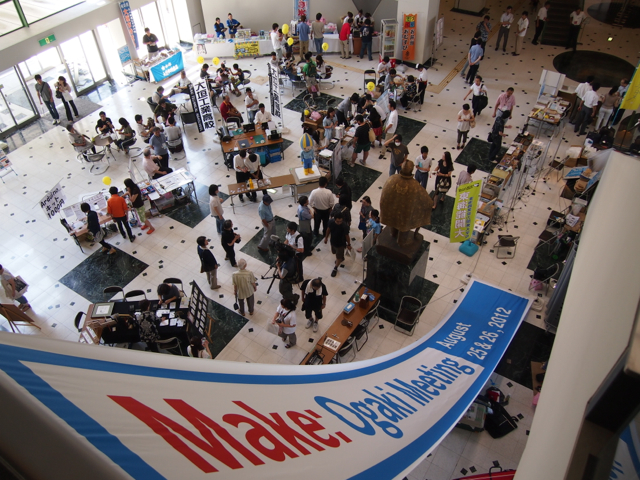

Make: Ogaki Meeting 2012に行ってきました。前回は早朝に車で出かけて、深夜に帰ってくるというスケジュールでしたが、さすがに疲れたので今回は新幹線ででかけました。名古屋から大垣への電車の車内に吊り広告があったのがびっくり。

久しぶりの大垣でしたが、大垣駅についたら前回の記憶がよみがえってきました。

今回は会場へはシャトルバスでの移動です。

目についたモノをまとめてみました。

## mbedを使って、iPhoneのタッチパネルを高速に押す機械

画面を機械的に押しているのではなく静電容量的に押しているようです。超高速に押せます。

<figure>

<figcaption>

OLYMPUS DIGITAL CAMERA

</figcaption>

</figure>

## mpod

mbedはUSBホスト機能を持っているのでUSBメモリに書き込むことができますが、USBスイッチチップを利用してmbedで書き込んだUSBメモリをそのまま外部のUSB機器につなぐボード。使い方としてはデジタルフォトフレームを接続して、ネットワークで書き込んでいました。今後何かに使えそうなのでボードを買っておきました。

<figure>

<figcaption>

OLYMPUS DIGITAL CAMERA

</figcaption>

</figure>

## Decoシールド

SAKURAやArduinoの出力にチップLEDを沢山つなげて見た目を楽しめます。これも買っちゃいました。

<figure>

<figcaption>

OLYMPUS DIGITAL CAMERA

</figcaption>

</figure>

がじぇボーイ

回転している部分にSAKURAボードがしこんであります。電源はブラシで供給。

右側の枠に制御用のLEDがあり、そこで回転数と表示パターンの指示ができます。

フレームはレゴで作られているのが良いですね。

<figure>

<figcaption>

OLYMPUS DIGITAL CAMERA

</figcaption>

</figure>

## 会場の様子

３階の会場から１階の会場を見下ろすとこんな感じでした。大にぎわいです。

<figure>

<figcaption>

OLYMPUS DIGITAL CAMERA

</figcaption>

</figure>

まだまだネタはありますが、今日はこのへんで。
