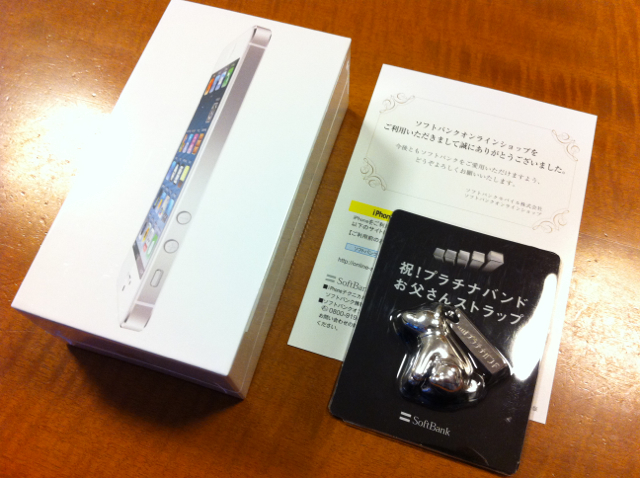
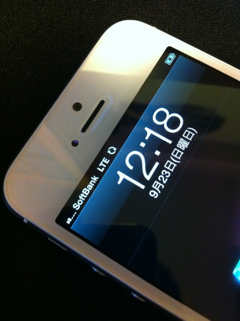

これまでiPhone 4（4Sではない）を使ってきましたが、割賦が終わったタイミングでiPhone 5が発売になりました。私のiPhone 4は16GBモデルで容量的にも速度的にもやや厳しくなってきたので、予約開始当日にソフトバンクオンラインショップで機種変更を申し込みました。

発売日の前日になっても本申し込みの案内が来なくて、ダメかなーと思っていたところに本申し込みの案内が届きホワイト 32GBで申し込みました。到着したのは発売日の２日後の日曜日。おまけとしてプラチナバンドのお父さんストラップが入っていましたよ。

あらかじめ買っておいた愛用のCrystal Shield（液晶保護シート）を貼付けて、Nano SIMを入れてすぐ回線を切り替えました。

なんと自宅がLTEエリア内。もっとも自宅だと無線LANを使うのであまり意味はないのですが。

ひとまず予めiPhone 4をiCloudにバックアップしてから、iPhone 5にリストアするだけで移行が完了しました。少し時間はかかりますが、PCに接続しなくてもバックアップとリストアができるのは便利ですね。
