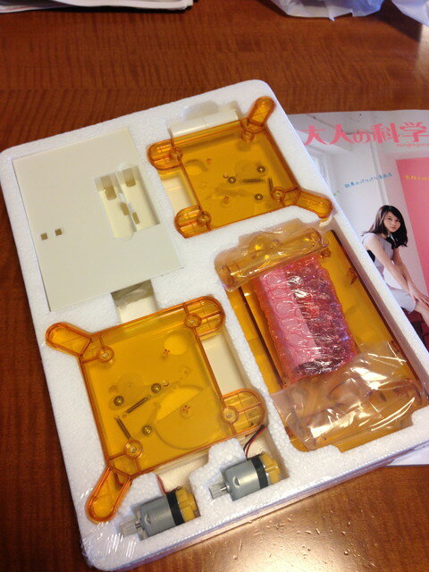
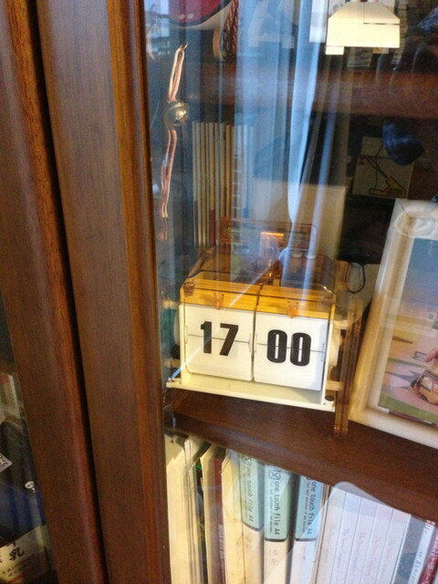
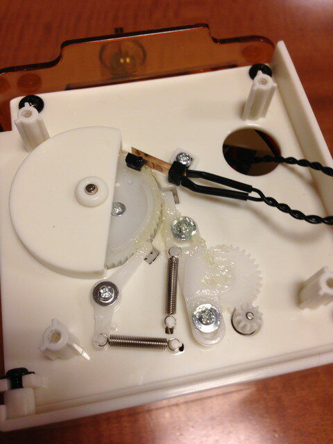

大人の科学マガジン パタパタ電波時計を組み立てました。

本体の組みたては難しくは無かったですが、パタパタする表示板を一枚ずつ取り付けていく作業が大変でした。

 

組み立て風景をVineというiPhoneアプリでコマ撮りながら進めました。 ６秒にまとめたものをYouTubeにアップしたのが以下の画像です。この画像はiPhoneのVineアプリだけで作っています。組み立て風景とかの記録にも良いですね。

我が家にある電波時計が０秒になったタイミングでこの時計もパタッと時刻が変わるのが楽しいですが、やや動作音が大きいのでガラスの戸棚の本棚に置くことで、やや音が小さくなりました。

今後消音の工夫とか他のマイコンとかと組み合わせとか、あちこちでいろんな改造が始まるのではないかと思います。

＜追記＞ @create\_clockさまからラチェット回りにグリスを塗ると音が静かになるとの情報をいただきましたので、手持ちのグリスを塗ったところ、以前よりは遥かに静かになりました。 
