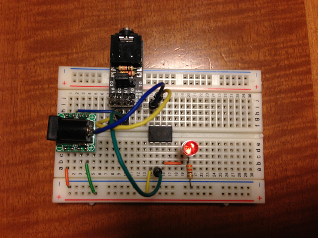
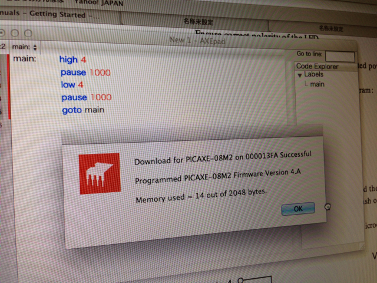

最近[秋月電子](http://akizukidenshi.com/catalog/c/cpicaxe/ "PICAXE")から販売が開始された[PICAXE](http://www.picaxe.com/ "http://www.picaxe.com/")（ピカクス）を買ってみました。  
なにやらプログラムをBASICで書くそうでどんなものだろうと興味を持ったのがきっかけです。  
購入したのは以下のものです。

- PICAXE-08M2
- PICAXEダウンロードケーブル
- ブレッドボード用PICAXEダウンロードケーブルコネクタ
- PICAXE-28X2シールドベース

開発環境で作成したプログラムをPICAXEチップに書き込む時にはシリアル通信のため、ダウンロードケーブルはUSB-シリアル変換を行っているようです。

PICAXE-08M2でLチカをしてみます。まずはハードウェアを準備します。今回はブレッドボードで組んでみました。

最初にブレッドボード用PICAXEダウンロードケーブルコネクタをハンダ付けして組み立てます。

このダウンロードケーブルコネクタは18/28/40ピンのPICAXEチップの場合は、そのままチップの横に取り付けられるので便利なのですが、今回使う8PのPICAXEチップの場合はケーブルで配線しなければなりません。

次にPICAXE-08M2チップをブレッドボードに取り付け、電源コネクタとダウンロードケーブルコネクタを取り付けて配線します。なぜかブレッドボードのワイヤーセットが見当たらなかったので適当なケーブルを３本使って見た目がスッキリしませんが、あとでワイヤーセットがでてきたらきれいにします。

接続はこんな感じ。電源はACアダプタ(+5V)を使いました。

PICAXE-08M2 1P +5V

PICAXE-08M2 2P Serial In ---- AXE029 IN(RXD)

PICAXE-08M2 3P C.4(Output) ---- LED ---- 330Ω ---- 0V

PICAXE-08M2 4P NC

PICAXE-08M2 5P NC

PICAXE-08M2 6P NC

PICAXE-08M2 7P Serial Out ----- AXE029 O2(TXD) ... O1でも良い。ジャンパを合わせたところ。

PICAXE-08M2 8P 0V ------------- AXE029 0V

外部電源 +5V

外部電源 0V

開発環境はMacBook Airを使いました。ソフトウェアのインストールは以下の２つだけです。いずれもPICAXEのサイトの[Download](http://www.picaxe.com/Software "Download")から無料で入手することができます。

- ダウンロードケーブルのドライバ (AXE027 USB Cable Driver)
- 開発環境のAXEpad

まずはダウンロードケーブルをMacに接続する前に、ドライバをインストールします。

インストールが完了したらターミナルを立ち上げて、

ls -l /dev/tty.usbserial-\*

と入力して、デバイス名を確認します。私のMacBook Airでは、/dev/tty.usbserial-000013FA となっていました。

次に開発環境のAXEpadをインストールして、ViewメニューのOptionsを選択します。Modeをクリックすると書き込むPICAXEチップの種類が設定できますので、PICAXE-08M2を選択しました。

次にPortを選択し、先ほどのダウンロードケーブルのデバイス名を設定します。

これで開発環境の準備は完了しました。

あとは、AXEpadに表示されている画面にプログラムを入力していきます。BASICで書きますがラベルが使えます。

入力が完了したら、PICAXEメニューのCheck Syntaxで問題ないか確認したあとに、ProgramでPICAXEチップに書き込みます。

無事Lチカが行えました。

明日はPICAXE-28X2シールドベースをいじってみたいと思います。
