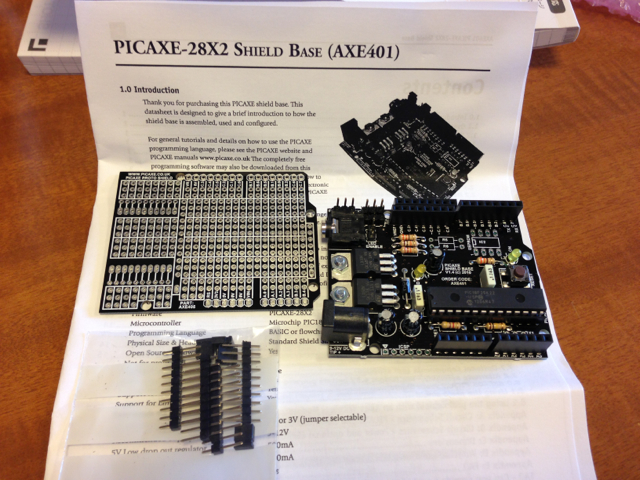

昨日秋月電子で購入した[PICAXE-28X2 Shield Base](http://akizukidenshi.com/catalog/g/gM-06613/ "PICAXE-28X2シールドベース")を動かしてみました。

まずはPICAXE-28X2 Shield BaseのマニュアルをPICAXEサイトで斜め読みして、+9VのACアダプタをつなぎ、AXEPadでmodeをPICAXE-28X2にした上で、Lチカのプログラムを入力しました。ProgramでPICAXE-28X2に書き込もうとしたところ、デバイスが見つかりませんという表示が。おかしいなあともう一度マニュアルをみたら、PICAXE-28X2 Shield Baseにはジャンパー設定が必要だったのでした。

確かにパッケージにジャンパーピンが４つ付属しています。まずこれを取り付けないと動きませんのでご注意を。

これで問題なくLチカができました。

https://youtu.be/nRtVLwgpIyY

次に手持ちのDecoシールドを取り付けて、LEDが順に点灯するプログラムを書いたところ、こちらも問題なく動きました。

https://youtu.be/X-smA6H2qOc

一通り動かしてみたあとで、BASICの文法を見ましたが、かなり複雑なことができるようなので今後いろいろ試してみようと思います。
