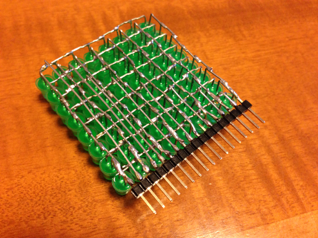

このまえ製作した[空中配線マトリクスLED](http://make.kosakalab.com/make/obaka-project/led_matrix/ "空中配線マトリクスLED")を動かしてみました。

まずはピンヘッダをハンダ付けしました。これも空中配線です。

LEDの間隔は2.54mmピッチではありませんので、やや無理矢理2.54mmピッチに合わせました。

縦のラインはそのままストレートにピンヘッダに接続、横のラインは0.6mmのスズめっき線で空中配線です。

これでブレッドボードで手軽に扱えるようになりました。

この写真では通常の太ピンのピンヘッダを取り付けていますが、ブレッドボードの抜き差しがやや大変だったので、あとで細ピンのピンヘッダに取り替えています。

ブレッドボードに取り付け、Arduino互換の[OnBoard](http://arduino.densikit.com/home/onboard "OnBoard")に接続しました。

無事すべてのLEDが正常に点灯することが確認できました。

動いている様子をYouTubeにアップしておきました。

https://youtu.be/oxkoUJ1-obc
