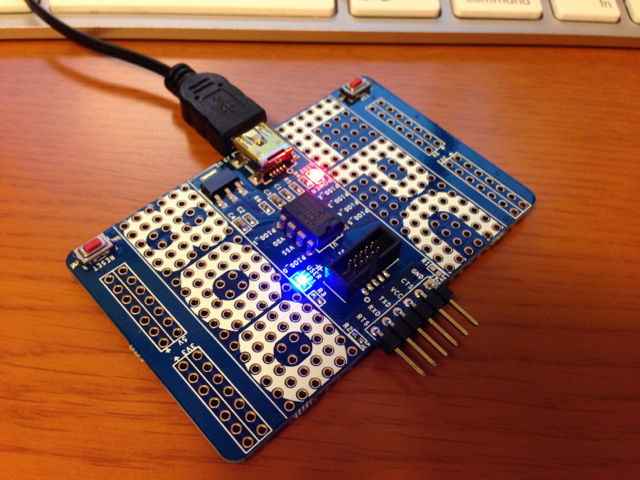
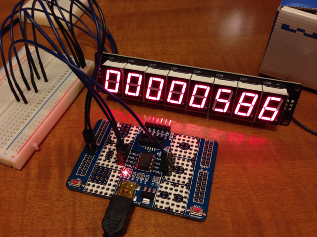

[Maker Faire Tokyo 2013](http://makezine.jp/event/mft2013/ "Maker Faire Tokyo 2013")に行ってきましたが、NXPセミコンダクターさんのブースで[LPC800-mini](http://www.nxp-lpc.com/lpc_boards/lpc800-mini/ "LPC800-mini")を頂いてしまいました。（先着25名だったようです。）

以前から8P DIPのLPC810には興味はあったのですが、なかなか入手するタイミングが無く、今回ようやく使う機会に恵まれました。NXPセミコンダクターの皆様ありがとうございました。

今回はこのLPC800-miniに[秋月電子の3-Wire 8桁7セグLEDモジュール](http://akizukidenshi.com/catalog/g/gM-06681/ "ＳＰＩ（３線式）　ＬＥＤ　Ｍｏｄｕｌｅ　８　Ｄｉｇｉｔａｌ　（Ａｒｄｕｉｎｏ Ｃｏｍｐａｔｉｂｌｅ）")を接続して動かしてみました。

LEDモジュールとLPC810との接続は以下の３本のみです。

LPC810　　 LEDモジュール

PIO0\_3 ---- DATA

PIO0\_2 ---- LATCH

PIO0\_1 ---- CLOCK

LEDモジュールに接続するために、LPC800-miniの基板にピンヘッダをハンダ付けし、そこから配線を行いました。LPC800-miniの基板には+5V, +3.3V, GNDのパターンもありますので、5VとGNDのところにもピンヘッダをハンダ付けし、ここからLEDモジュールにUSBからの5Vを供給しています。

LPC800-miniとLEDモジュールの接続はこんな感じです。

メス−メスのケーブルが無かったので途中ブレッドボードをかませていますが、ケーブルがあればシンプルになります。

プログラムは前回mbed用に作成したロジックをほぼそのまま流用しています。GPIOの制御の部分は[サンプルプログラム](https://github.com/microbuilder/LPC810_CodeBase "microbuilder/LPC810_CodeBase")を参考にして、LPC810に合わせています。作成したソースコードは[こちら](https://github.com/kanpapa/nxp/blob/master/LPCXpresso/workspace/LPC810_CodeBase_3wire7seg/src/main.c "kanpapa/nxp/blob/master/LPCXpresso/workspace/LPC810_CodeBase_3wire7seg/src/main.c")です。

動作中の様子をYouTubeにアップしておきました。

今回はLPC810のGPIOを3つしか使用していません。サンプルプログラムでは残りの2ピンはUARTに割当られています。シリアルで送られてきた数字をこのLEDモジュールに表示することもできるでしょう。8P DIPとは言え応用範囲は広そうです。
