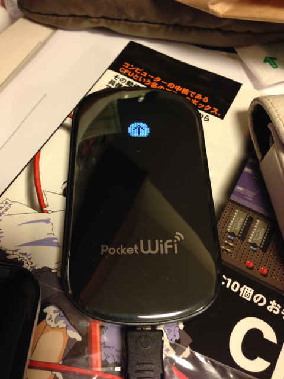

イオシス路地裏店でPocket WiFiルータ GP-02がお安い値段で売っていたので衝動買いしてしまいました。

これまで光ポータブルのWiFiルーターで使っていたDTI 490円SIMをいれましたが問題なく通信できています。電池の持ちのは想定内だったのでこれは良い買い物をしました。光ポータブルのレンタルは年内で解約できます。USBで接続するだけでWifiルーターに入っているWin/Macのドライバをインストールできるのも便利です。ファームウェアは最新版では無かったので最新版に更新しておきました。
