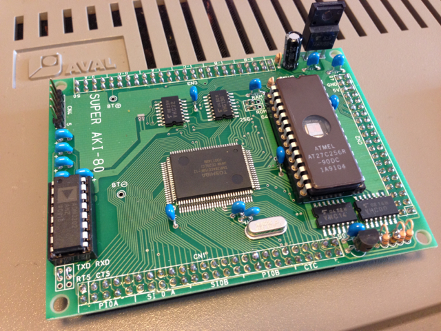

突然ですが、Super AKI-80を使ってLチカをしてみました。  
昔実際に作っていたZ-80系の古い本「つくりながら学ぶマイコン設計トレーニング」（CQ出版社）を入手したこともあり、本物のZ-80を動かしたくなってしまいました。



## EPROMの入手

まずはSuper AKI-80に取り付けるEPROMを探さねばなりません。  
AKI-80に取り付けられる容量は27256まで、アクセススピードは100ns以下という制約があります。  
手持ちのEPROMは27256はありますが、アクセススピードは250ns程度。これではつかえません。  
秋葉原でも探しましたが見当たらないので、ヤフオクで27C256 90nsというものを見つけて４個購入しました。これで当面はしのげそうです。

## Lチカプログラムの作成

次にLチカのプログラム作成です。Super AKI-80に実装されている8255のポートにLEDを取り付けることにします。  
プログラムを作るためにアセンブラが必要になりますので（これぐらいの規模でしたらハンドアセンブルという手もありますが・・・）手頃なものはないか探したところVectorで[XASM](http://www.vector.co.jp/soft/dos/prog/se008546.html "XASM")というものを見つけ試してみました。  
このXASMはZ-80以外の8ビットCPUにも対応しているものです。ただし、Windows 64bit環境では動かないようなので、32bit環境で動かしました。  
アセンブル出力としてインテルHEXファイルを生成してくれますので、そのまま手持ちのROMライター（Pecker-11）に転送できます。  
LED点滅プログラムをXASMでアセンブルした結果はこんな感じです。（久々！）  
SPとかも設定しておらず相当手抜きですが、動作確認用なので。

```
;;;;;;;;;;;;;;;;;;;;;;;;;;;;;;;
;; SUPER AKI-80 TEST PROGRAM
;;
;;;;;;;;;;;;;;;;;;;;;;;;;;;;;;;
ORG  0
0000: C3 3B 00              JP START
ORG 8H
0008: C3 3B 00              JP START
ORG 10H
0010: C3 3B 00              JP START
ORG 18H
0018: C3 3B 00              JP START
ORG 20H
0020: C3 3B 00              JP START
ORG 28H
0028: C3 3B 00              JP START
ORG 30H
0030: C3 3B 00              JP START
ORG 38H
0038: C3 3B 00              JP START
;;
;; TEST MAIN
;;
003B: 3E 80         START:  LD   A,80H
003D: D3 33                 OUT (33H),A    ;PPI CHIP0 A-PORT CMD
003F: 3E 00                 LD   A,0
0041: D3 30         LOOP:   OUT (30H),A    ;PPI CHIP0 A-PORT DATA
0043: 06 FF                 LD   B,0FFH
0045: 0E FF         LOOP1:  LD   C,0FFH
0047: 00            LOOP2:  NOP
0048: 00                    NOP
0049: 00                    NOP
004A: 00                    NOP
004B: 00                    NOP
004C: 0D                    DEC C
004D: 20 F8                 JR NZ,LOOP2
004F: 05                    DEC B
0050: 20 F3                 JR NZ,LOOP1
0052: 3C                    INC A
0053: 18 EC                 JR LOOP
END
```

## EPROMの書き込み

XASMで生成したインテルHEXファイルをPecker-11にシリアル転送しました。  
その後、27C256をPecker-11に取り付けます。


今回入手したEPROMは新品のようでしたが、念のためイレースチェックを行い消去済であることを確認し、書き込みました。


## Lチカの確認

Pecker-11で書き込んだEPROMをAKI-80に取り付けます。

AKI-80の8255のポートAにLEDを接続し電源を投入したところ、LEDが点滅を初めました。


久々に本物のZ-80に触れることができました。Lチカだけでも大変ですね。  
この次はモニタぽいものを作ってみようと思います。
