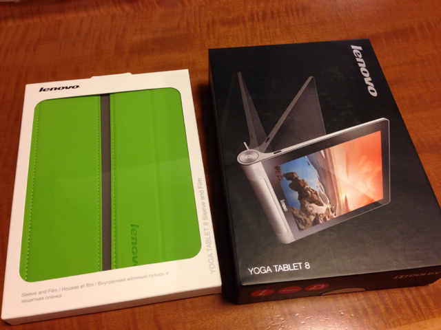
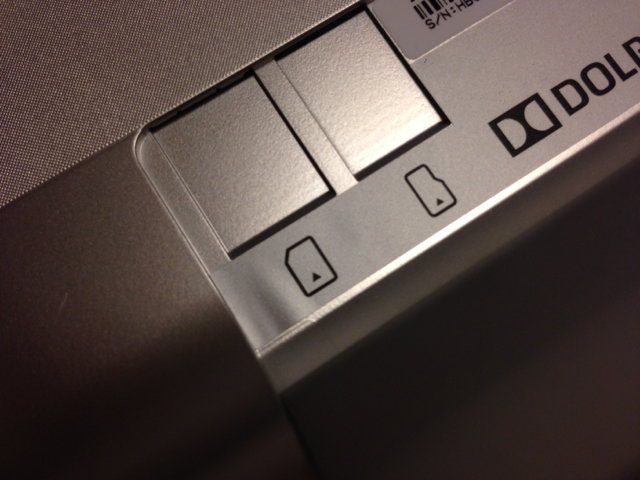
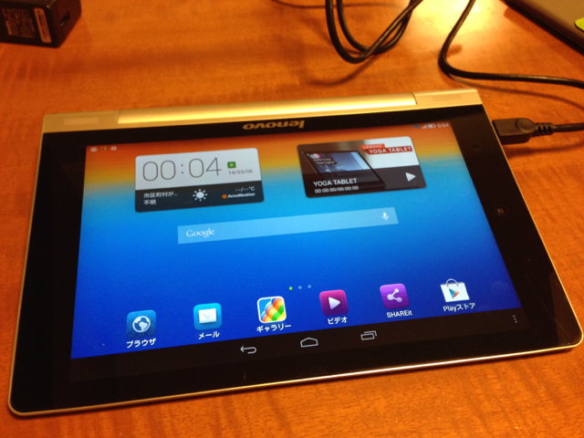

Lenovo Yoga Teblet 8を購入しました。購入動機は3G版でもそこそこ安く、おまけに３月末まで4000円キャッシュバックキャンペーンをやっているのです。レビュー評価も良いようで、Nexus7 2012並みのスピードとのことで使えそうです。

到着したYoga Tablet 8です。純正のスリーブケースも買いました。

純正スリーブケースはいい感じです。マグネットで自然に吸い付きます。

でも純正ケースに付属の液晶保護シートの端が梱包が悪く折れ曲がっていました。本体に貼付けてもこんな感じ。ここは減点ですね。

裏返して、手持ちのmicroSDカードと、手持ちのIIJmio SIMカードを取り付けましたが、外側からはカードを装着しているのかしていないのかも分かりません。何かに当たった拍子でカードが抜け落ちるということは無さそうです。

いつものようにセットアップをしたところ、特に何もしなくてもIIJmio SIMが認識されてアンテナが立っていました。この点は面倒なAPNなどの設定をしなくても良いので楽です。

Yoga Tablet 8の特徴でもあるバッテリーシリンダーですが、これを使った傾斜は非常に見やすく、立てることもできますので非常に便利でした。

スピードも各種レビューのように以前使っていたNexus7 2012ぐらいでしたので、ストレスもなく操作することができます。

問題は液晶保護シートが今ひとつということですが、これはまたの機会に交換したいと思います。
